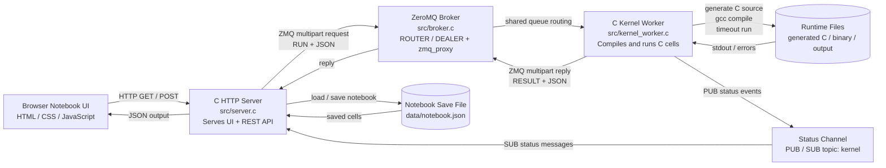
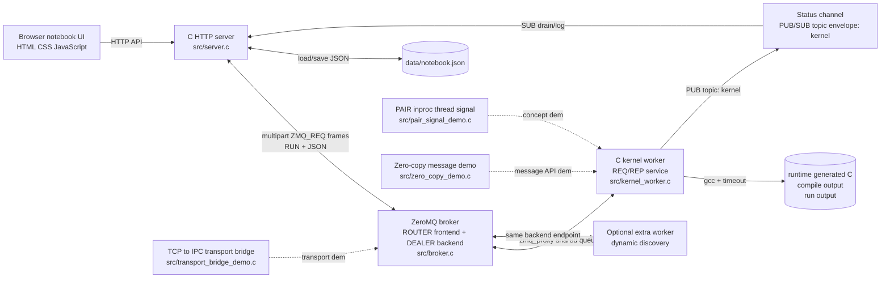

# Mini Jupyter Notebook Clone Using C + ZeroMQ

This project is a browser-based notebook clone for a Network Programming presentation. It is not a full Jupyter implementation. It demonstrates how ZeroMQ can connect a web-facing process to a broker and one or more execution workers.

## Architecture

- `src/server.c` serves the browser UI and exposes small HTTP APIs.
- `src/broker.c` is a ZeroMQ `ROUTER/DEALER` proxy using `zmq_proxy()`.
- `src/kernel_worker.c` receives notebook cells, generates cumulative C source, compiles it, runs it with a timeout, and returns JSON results.
- `web/` contains the static notebook UI.
- `data/notebook.json` stores the saved notebook.

The browser never executes code. The C server sends execution requests to the ZeroMQ broker, and the C worker performs compile/run work.

## Notebook UI

The browser UI is styled after classic Jupyter Notebook:

- Notebook title and checkpoint-style header.
- Compact toolbar with save, insert cell, run all, and cell type controls.
- Code cells with `In [ ]:` prompts and output cells with `Out[ ]:` prompts.
- Execution counters update when cells run through the C kernel worker.

## System Flowchart



Execution flow:

```text
Browser
  -> C HTTP Server
  -> ZeroMQ ROUTER/DEALER Broker
  -> C Kernel Worker
  -> generated C program
  -> output returns through ZeroMQ
  -> Browser displays result
```

## Full Architecture Diagram



## Requirements

Use WSL Ubuntu.

```bash
sudo apt update
sudo apt install -y gcc make pkg-config libzmq3-dev coreutils
```

`coreutils` provides the `timeout` command used by the worker.

## Build

```bash
make clean
make
```

## Run

Open three WSL terminals in this project directory.

Terminal 1:

```bash
./build/broker
```

Terminal 2:

```bash
./build/kernel_worker
```

Terminal 3:

```bash
./build/server
```

Then open:

```text
http://127.0.0.1:8080
```

You can start multiple workers in separate terminals:

```bash
./build/kernel_worker
```

The broker will distribute requests through the shared queue pattern.

Extra concept demos:

```bash
./build/pair_signal_demo
./build/zero_copy_demo
./build/transport_bridge_demo
```

## Demo Script

1. Load the browser page.
2. Run the first cell:
   ```c
   int x = 42;
   printf("x is ready\n");
   ```
3. Run the second cell:
   ```c
   printf("x = %d\n", x);
   ```
   This proves cumulative notebook execution.
4. Add a compile error:
   ```c
   printf("missing semicolon")
   ```
5. Add a timeout case:
   ```c
   while (1) {}
   ```
6. Stop the worker and run a cell to show the server reporting kernel unavailability.
7. Start a second `kernel_worker` to show dynamic worker discovery through the broker.
8. Run `pair_signal_demo` to show `PAIR` sockets and `inproc://` thread signaling.
9. Run `zero_copy_demo` to show `zmq_msg_init_data()` and its free callback.
10. Run `transport_bridge_demo` to show a `tcp://` to `ipc://` proxy bridge.

## ZeroMQ Concepts Demonstrated

| Presentation concept | Where it appears |
| --- | --- |
| Socket lifecycle: create/destroy | `zmq_ctx_new()`, `zmq_socket()`, `zmq_close()`, `zmq_ctx_destroy()` in `server.c`, `broker.c`, `kernel_worker.c`, and demos |
| Configure sockets | `zmq_setsockopt()` for linger, timeouts, subscriptions, and high-water marks |
| Check socket options | `zmq_getsockopt()` reads `ZMQ_SNDHWM` in `broker.c` and `ZMQ_RCVMORE` in multipart receive code |
| Plug into topology | `zmq_bind()` in broker/server/status demos; `zmq_connect()` in server and workers |
| Bind as server side | Broker binds `tcp://127.0.0.1:7000` and `tcp://127.0.0.1:7001`; server binds the PUB/SUB status endpoint |
| Connect as client side | HTTP server connects to broker frontend; workers connect to broker backend |
| Carry data with simple APIs | `zmq_send()` and `zmq_recv()` in status publishing and demo programs |
| Carry data with message APIs | `zmq_msg_init_size()`, `zmq_msg_send()`, `zmq_msg_recv()`, `zmq_msg_close()` in `server.c` and `kernel_worker.c` |
| Zero-copy messages | `zmq_msg_init_data()` fourth argument/free callback in `zero_copy_demo.c` |
| High-water marks | `ZMQ_SNDHWM` and `ZMQ_RCVHWM` in `broker.c` |
| I/O threads | The project uses one ZeroMQ context per process; this is where ZeroMQ manages I/O threads internally |
| Unicast transports | Main app uses `tcp://`; PAIR demo uses `inproc://`; bridge demo uses `ipc://` |
| ZeroMQ is not a neutral carrier | Socket type controls behavior: `REQ` must send then receive; `REP` must receive then send; `PUB` only publishes; `SUB` filters topics |
| REQ/REP pattern | `server.c` uses `ZMQ_REQ`; `kernel_worker.c` uses `ZMQ_REP` |
| PUB/SUB envelopes | Worker publishes multipart `kernel` topic messages; server subscribes to topic `kernel` |
| PAIR pattern | `pair_signal_demo.c` coordinates main thread and worker thread over `inproc://` |
| ROUTER/DEALER shared queue | `broker.c` uses `ZMQ_ROUTER` frontend and `ZMQ_DEALER` backend |
| Intermediary/proxy | `broker.c` and `transport_bridge_demo.c` use `zmq_proxy()` |
| Dynamic discovery problem | New `kernel_worker` processes can connect without browser/server changes |
| Handling multiple sockets | `kernel_worker.c` uses `zmq_poll()` before receiving execution requests; server drains status with `zmq_poll()` |
| Multipart messages | Server sends `RUN` + JSON frames; worker replies `RESULT` + JSON frames |
| Multithreading with ZeroMQ | `pair_signal_demo.c` gives each thread its own socket |
| Signaling between threads | `PAIR` over `inproc://node-control` in `pair_signal_demo.c` |
| Node coordination | Main thread sends `start-node`; worker replies `worker-ack` in `pair_signal_demo.c` |
| Transport bridging | `transport_bridge_demo.c` bridges `tcp://127.0.0.1:7010` to `ipc:///tmp/zeromq-notebook-bridge.ipc` |
| Error handling | `zmq_errno()` and `zmq_strerror()` are used for ZeroMQ failures |
| Interrupt handling | `SIGINT`, `SIGTERM`, and `EINTR` handling in long-running processes |

## Safety Note

This is a trusted local classroom demo. It compiles and runs C code typed into the browser. Do not expose it to a network or run untrusted code.
