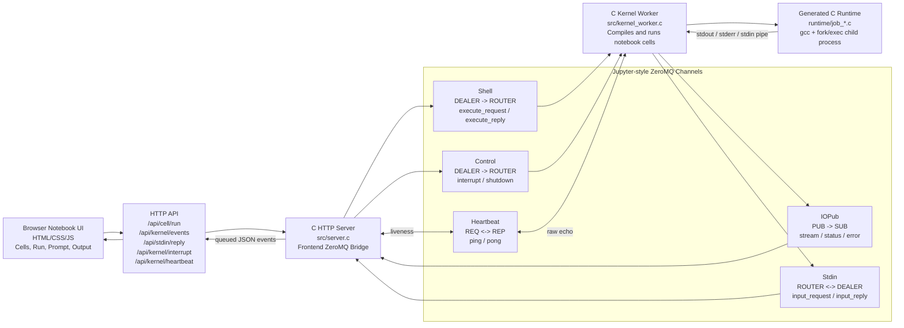
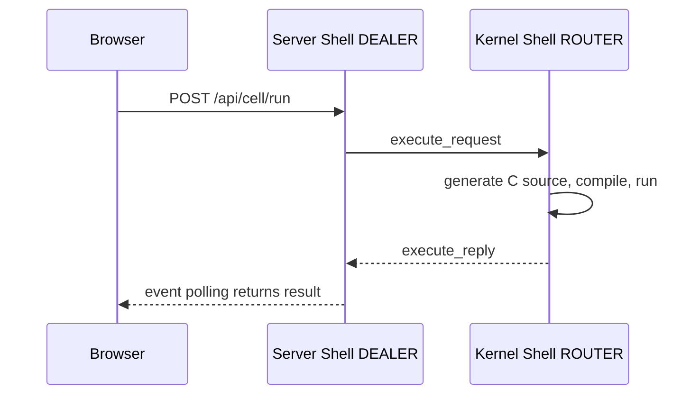
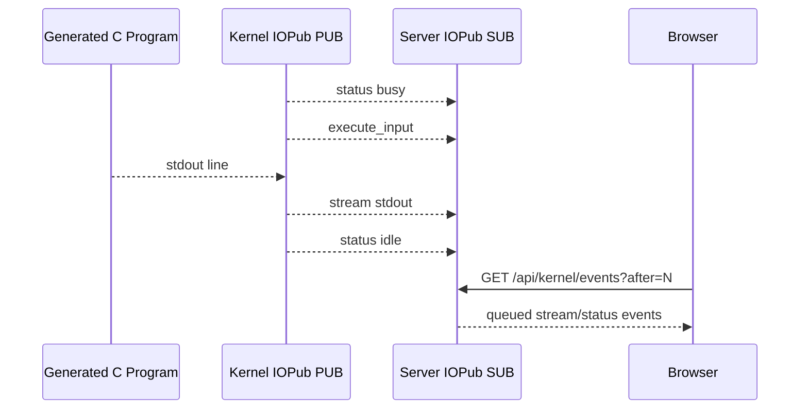
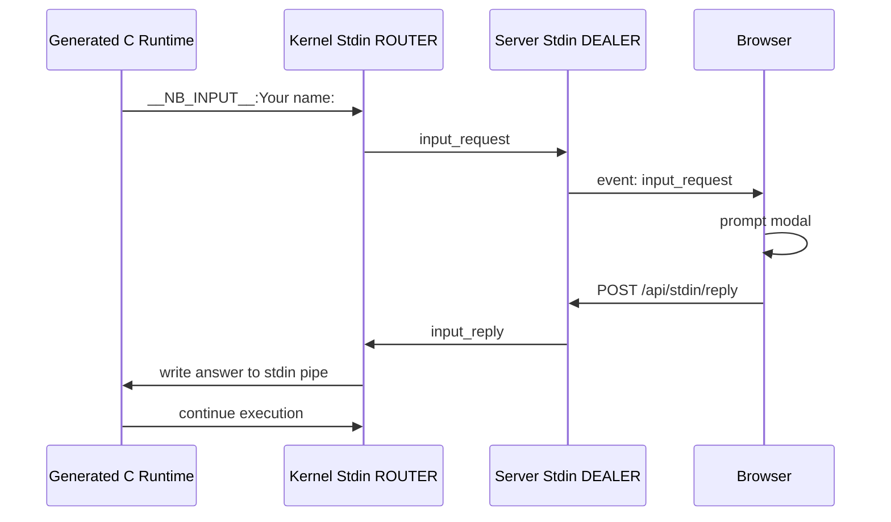
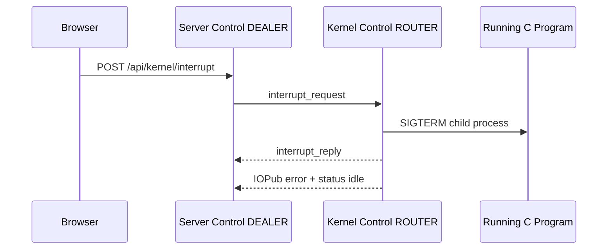
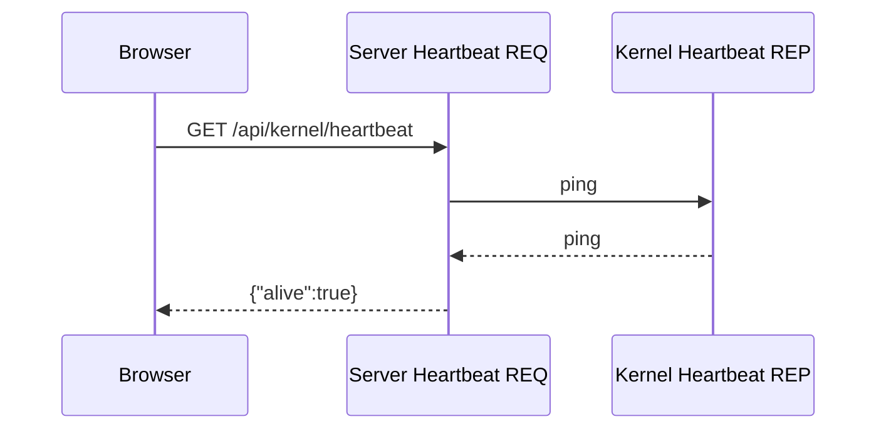
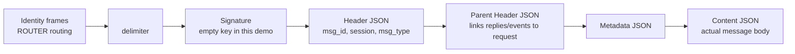
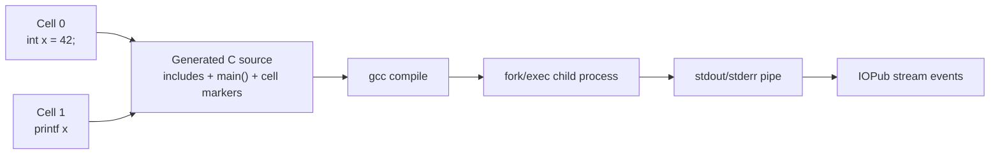

# ZMQBook C

A tiny C notebook powered by ZeroMQ.

ZMQBook C is a browser-based mini notebook for a Network Programming presentation. Users write C snippets in notebook cells, run them from the browser, and see live output. Internally, the project demonstrates the same core ZeroMQ channel idea used by Jupyter kernels: **Shell**, **IOPub**, **Stdin**, **Control**, and **Heartbeat**.

This is an educational project, not a full Jupyter implementation. The goal is to make ZeroMQ socket roles and message patterns visible in a working C system.

## Wide Architecture Diagram

The browser cannot open ZeroMQ sockets directly. Because of that, `src/server.c` acts as both the HTTP server for the browser and the frontend-side ZeroMQ bridge. `src/kernel_worker.c` is the C kernel process that owns the Jupyter-style sockets.

The diagram is intentionally left-to-right and wide for presentation slides, roughly matching a 20:9 layout.



## Channel Overview

| Channel | Frontend side | Kernel side | Direction | Purpose |
| --- | --- | --- | --- | --- |
| Shell | `DEALER` in `server.c` | `ROUTER` in `kernel_worker.c` | request/reply | Normal notebook requests such as execute code and kernel info |
| IOPub | `SUB` in `server.c` | `PUB` in `kernel_worker.c` | kernel broadcast | Live output, status, executed input, and errors |
| Stdin | `DEALER` in `server.c` | `ROUTER` in `kernel_worker.c` | request/reply initiated by kernel | Interactive input while code is running |
| Control | `DEALER` in `server.c` | `ROUTER` in `kernel_worker.c` | request/reply | High-priority interrupt and shutdown commands |
| Heartbeat | `REQ` in `server.c` | `REP` in `kernel_worker.c` | ping/pong | Liveness check |

The kernel writes a connection file:

```text
data/kernel-connection.json
```

It uses localhost TCP ports and an empty HMAC key for classroom simplicity:

```text
Shell:     tcp://127.0.0.1:7010
IOPub:     tcp://127.0.0.1:7011
Stdin:     tcp://127.0.0.1:7012
Control:   tcp://127.0.0.1:7013
Heartbeat: tcp://127.0.0.1:7014
```

## Channel Details

### Shell Channel

The Shell channel is the normal request/reply path for notebook commands.

In this project:

- The C server owns a frontend-side `DEALER` socket.
- The kernel owns a `ROUTER` socket bound to port `7010`.
- The browser calls `POST /api/cell/run`.
- The server sends a Jupyter-style `execute_request` on Shell.
- The kernel replies with `execute_reply`.

Main messages:

| Message | Meaning |
| --- | --- |
| `kernel_info_request` | Ask the kernel what language and protocol it supports |
| `kernel_info_reply` | Kernel replies with C language metadata |
| `execute_request` | Ask the kernel to execute notebook code |
| `execute_reply` | Final execution status, execution count, run index, and output summary |
| `shutdown_request` | Ask the kernel to shut down |
| `shutdown_reply` | Kernel confirms shutdown |

Example flow:



Why it matters: Shell is the command channel. It answers "please run this code" and "did execution finish successfully?"

### IOPub Channel

IOPub means input/output publish. It is a one-way broadcast channel from the kernel to the frontend.

In this project:

- The kernel owns a `PUB` socket bound to port `7011`.
- The server owns a `SUB` socket and subscribes to all topics.
- The browser polls `GET /api/kernel/events?after=N`.
- The server returns queued IOPub events as JSON.

Main messages:

| Message | Meaning |
| --- | --- |
| `status` | Kernel state such as `busy` or `idle` |
| `execute_input` | Code that is currently being executed |
| `stream` | Live stdout/stderr output |
| `error` | Compile error, runtime error, timeout, or interrupt |

Example flow:



Why it matters: Shell gives the final reply, but IOPub shows what is happening while execution is running. This is how notebook output can appear live.

### Stdin Channel

The Stdin channel lets running code ask the frontend for input.

In this project:

- The kernel owns a `ROUTER` socket bound to port `7012`.
- The server owns a frontend-side `DEALER` socket.
- User C code calls `nb_input()`.
- The kernel sends `input_request`.
- The browser shows a prompt modal.
- The browser sends `POST /api/stdin/reply`.
- The server sends `input_reply`.
- The kernel writes the answer into the child process stdin pipe.

Use this helper in a notebook cell:

```c
char name[64];
nb_input("Your name: ", name, sizeof name);
printf("hello %s\n", name);
```

Flow:



Why it matters: Stdin demonstrates reverse interaction. The kernel is not only answering the browser; it can also ask the browser for data while code is running.

For classroom convenience, generated notebook code also wraps simple `scanf(...)` calls. That means this common C example opens a browser prompt:

```c
int age;
printf("Enter your age: ");
scanf("%d", &age);
printf("age = %d\n", age);
```

The kernel turns the pending prompt text into a Stdin `input_request`, then feeds the browser's answer back to the generated C process.

### Control Channel

The Control channel is for high-priority commands that should not wait behind normal execution.

In this project:

- The server owns a frontend-side `DEALER` socket.
- The kernel owns a `ROUTER` socket bound to port `7013`.
- The browser calls `POST /api/kernel/interrupt` or `POST /api/kernel/shutdown`.
- The kernel handles the command even while execution is running.

Main messages:

| Message | Meaning |
| --- | --- |
| `interrupt_request` | Stop the currently running generated C child process |
| `interrupt_reply` | Confirm interrupt was received |
| `shutdown_request` | Ask the kernel process to exit |
| `shutdown_reply` | Confirm shutdown |

Example:

```c
while (1) {}
```

Click **Interrupt** in the UI. The server sends `interrupt_request` on Control. The kernel terminates the child process and publishes an IOPub error/status update.

Flow:



Why it matters: If interrupt used the same path as normal code execution, it could be blocked behind the currently running code. Control gives high-priority commands their own route.

### Heartbeat Channel

Heartbeat checks whether the kernel process is alive.

In this project:

- The server owns a `REQ` socket.
- The kernel owns a `REP` socket bound to port `7014`.
- The server sends raw bytes.
- The kernel echoes the same bytes back.
- The browser can call `GET /api/kernel/heartbeat`.

Flow:



Why it matters: Heartbeat does not execute code. It answers only one question: "Is the kernel responding?"

## Jupyter Multipart Message Shape

Jupyter messages are multipart ZeroMQ messages. This project implements the core frame shape in `src/jupyter_proto.c`.



Example content:

```json
{
  "code": "printf(\"hello\\n\");",
  "silent": false,
  "store_history": true,
  "allow_stdin": true,
  "run_index": 0,
  "cells": ["printf(\"hello\\n\");"]
}
```

This classroom project uses an empty HMAC key, so the signature frame is empty. That keeps the implementation focused on socket behavior and multipart structure.

## How C Execution Works

Cells are cumulative. Running cell `N` generates one C program containing cells `0..N`, so later cells can use variables from earlier cells.



Example:

```c
int x = 42;
```

Then:

```c
printf("x = %d\n", x);
```

The kernel inserts markers such as `__CELL_START_0__` and `__CELL_END_0__` so output can be mapped back to notebook cells.

## Browser API

| Endpoint | Purpose |
| --- | --- |
| `GET /api/notebook` | Load saved notebook JSON |
| `POST /api/notebook/save` | Save notebook JSON |
| `POST /api/cell/run` | Send Shell `execute_request` |
| `POST /api/run-all` | Send execution requests from the UI |
| `GET /api/kernel/events?after=N` | Poll queued Shell/IOPub/Stdin/Control events |
| `POST /api/stdin/reply` | Send Stdin `input_reply` |
| `POST /api/kernel/interrupt` | Send Control `interrupt_request` |
| `POST /api/kernel/shutdown` | Send Control `shutdown_request` |
| `GET /api/kernel/heartbeat` | Check Heartbeat ping/pong |

## Requirements

Use WSL Ubuntu.

```bash
sudo apt update
sudo apt install -y gcc make pkg-config libzmq3-dev python3
```

Optional external-client smoke test:

```bash
pip install jupyter_client
```

## Build

```bash
make clean
make
```

## Run

Open two WSL terminals in this project directory.

Terminal 1:

```bash
./build/kernel_worker
```

Terminal 2:

```bash
./build/server
```

Then open:

```text
http://127.0.0.1:8080
```

The old `./build/broker` binary still exists as an optional ROUTER/DEALER shared-queue demo, but it is no longer required for the main notebook execution path.

## Demo Script

1. Start `kernel_worker` and `server`.
2. Open the browser notebook.
3. Run stdout:
   ```c
   printf("hello zeromq notebook\n");
   ```
   Explain: Shell starts execution; IOPub streams stdout.
4. Run cumulative cells:
   ```c
   int x = 42;
   printf("x is ready\n");
   ```
   then:
   ```c
   printf("x = %d\n", x);
   ```
   Explain: running a later cell recompiles cells from the top.
5. Run stdin with normal C-style input:
   ```c
   int age;
   printf("Enter your age: ");
   scanf("%d", &age);
   printf("age = %d\n", age);
   ```
   Explain: the generated runtime wraps `scanf()` and sends a Stdin `input_request`.
6. Or run stdin with the explicit helper:
   ```c
   char name[64];
   nb_input("Your name: ", name, sizeof name);
   printf("hello %s\n", name);
   ```
   Explain: `nb_input()` directly sends a Stdin `input_request`; browser replies with `input_reply`.
7. Run an infinite loop:
   ```c
   while (1) {}
   ```
   Click Interrupt.
   Explain: Control has a separate high-priority route.
8. Check heartbeat:
   ```bash
   curl http://127.0.0.1:8080/api/kernel/heartbeat
   ```

## Smoke Test

With `./build/kernel_worker` running:

```bash
python3 tests/smoke_jupyter_channels.py
```

The test uses `jupyter_client` and `data/kernel-connection.json` to verify:

- Heartbeat ping.
- `kernel_info_request`.
- `execute_request`.
- IOPub stream output.
- Stdin request/reply.

## ZeroMQ Concepts Demonstrated

| Presentation concept | Where it appears |
| --- | --- |
| Socket lifecycle | Context/socket creation and cleanup in `server.c`, `kernel_worker.c`, and demos |
| Configure sockets | Linger, identity, subscribe filters, and timeouts |
| Bind/connect topology | Kernel binds five channels; server connects as frontend bridge |
| ROUTER/DEALER | Shell, Stdin, Control, and optional `broker.c` demo |
| PUB/SUB | IOPub stream/status/error publishing |
| REQ/REP | Heartbeat ping/pong |
| Multipart messages | Jupyter frames: identities, delimiter, signature, header, parent, metadata, content |
| Message envelopes | IOPub topic frames such as `stream.stdout`, `status`, `error` |
| Handling multiple sockets | Kernel uses `zmq_poll()` to watch Shell, Control, Heartbeat, and child output |
| Error handling | Compile errors, runtime errors, timeout, interrupt, and ZeroMQ errors |
| Interrupt handling | Control channel, `SIGTERM` child process, `SIGINT`/`SIGTERM` process shutdown |
| PAIR / zero-copy / transport bridge | Extra demo binaries remain available |

## Difference From Full Jupyter

This project implements the educational core of the Jupyter ZeroMQ architecture, not the complete Jupyter ecosystem.

Included:

- Five Jupyter-style sockets.
- Jupyter multipart frame shape.
- Empty-signature messages.
- Basic `jupyter_client` compatibility for simple requests.

Not included:

- JupyterLab kernelspec launch integration.
- HMAC signing with a non-empty key.
- Completion, inspection, rich display MIME bundles, widgets, comms, debugger, or history APIs.
- A secure sandbox. This is trusted local code execution only.

## Presentation Animation

The Manim source lives in `animation/architecture_animation.py`.

Render with:

```bash
animation/.venv/bin/python -m manim -qm --media_dir animation/media animation/architecture_animation.py ZeroMQNotebookArchitecture
```

Rendered video output is intentionally ignored and should not be committed.

## Extra Concept Demos

```bash
./build/broker
./build/pair_signal_demo
./build/zero_copy_demo
./build/transport_bridge_demo
```

These support the presentation topics around ROUTER/DEALER proxies, PAIR signaling, zero-copy messages, and transport bridging.

## Safety Note

This is a trusted local classroom demo. It compiles and runs C code typed into the browser. Do not expose it to a network or run untrusted code.
