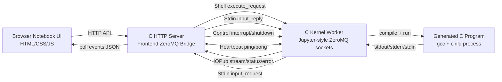
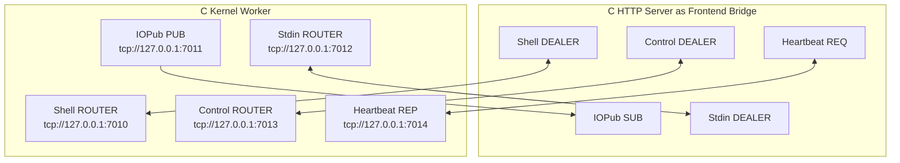
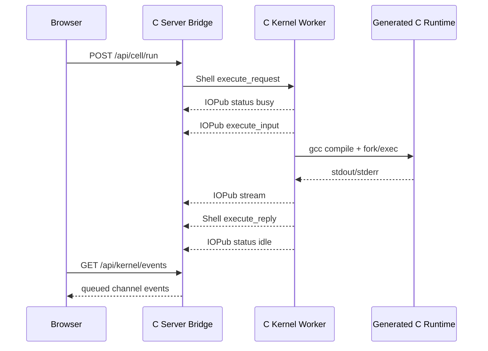
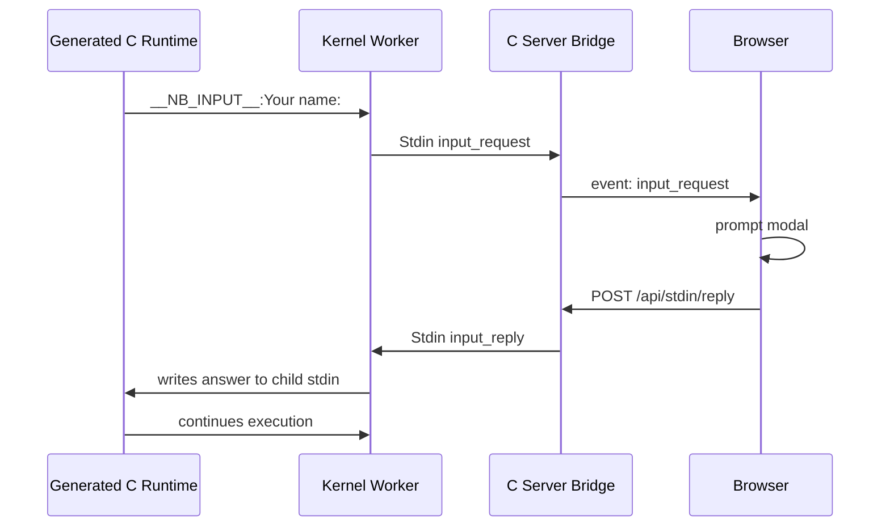

# ZMQBook C

A tiny C notebook powered by ZeroMQ.

This project is a browser-based mini notebook for a Network Programming presentation. It is not a full Jupyter implementation, but it now uses the same core ZeroMQ channel idea as a Jupyter kernel: Shell, IOPub, Stdin, Control, and Heartbeat.

The browser UI is static HTML/CSS/JavaScript. The backend components are written in C and communicate through ZeroMQ.

## Architecture

The browser cannot open ZeroMQ sockets directly, so `src/server.c` acts as the browser-facing HTTP server and the frontend-side ZeroMQ bridge. `src/kernel_worker.c` is the educational C kernel.



## Jupyter-Style Socket Channels



| Channel | Socket pattern | Project behavior |
| --- | --- | --- |
| Shell | Frontend `DEALER`, kernel `ROUTER` | Sends `execute_request`, `kernel_info_request`, receives `execute_reply` |
| IOPub | Kernel `PUB`, frontend `SUB` | Streams stdout, errors, `busy`/`idle`, and `execute_input` events |
| Stdin | Kernel `ROUTER`, frontend `DEALER` | `nb_input()` sends `input_request`; browser prompt sends `input_reply` |
| Control | Frontend `DEALER`, kernel `ROUTER` | Interrupts infinite loops and sends shutdown commands |
| Heartbeat | Frontend `REQ`, kernel `REP` | Raw ping/pong liveness check |

The connection file is written to:

```text
data/kernel-connection.json
```

It uses localhost TCP ports and an empty HMAC key for classroom simplicity.

## How Execution Works



Cells are cumulative. Running cell `N` generates one C program containing cells `0..N`, so later cells can use variables from earlier cells.

Example:

```c
int x = 42;
```

Then:

```c
printf("x = %d\n", x);
```

## Interactive Input

Use `nb_input()` in notebook cells:

```c
char name[64];
nb_input("Your name: ", name, sizeof name);
printf("hello %s\n", name);
```

Flow:



`nb_input()` is the supported classroom input API. Plain `scanf()` prompt detection is not guaranteed.

## Requirements

Use WSL Ubuntu.

```bash
sudo apt update
sudo apt install -y gcc make pkg-config libzmq3-dev python3
```

Optional external-client smoke test:

```bash
pip install jupyter_client
```

## Build

```bash
make clean
make
```

## Run

Open two WSL terminals in this project directory.

Terminal 1:

```bash
./build/kernel_worker
```

Terminal 2:

```bash
./build/server
```

Then open:

```text
http://127.0.0.1:8080
```

The old `./build/broker` binary still exists as an optional ROUTER/DEALER shared-queue demo, but it is no longer required for the main notebook execution path.

## Browser API

| Endpoint | Purpose |
| --- | --- |
| `GET /api/notebook` | Load saved notebook JSON |
| `POST /api/notebook/save` | Save notebook JSON |
| `POST /api/cell/run` | Send Shell `execute_request` |
| `POST /api/run-all` | Send execution requests from the UI |
| `GET /api/kernel/events?after=N` | Poll queued Shell/IOPub/Stdin/Control events |
| `POST /api/stdin/reply` | Send Stdin `input_reply` |
| `POST /api/kernel/interrupt` | Send Control `interrupt_request` |
| `POST /api/kernel/shutdown` | Send Control `shutdown_request` |
| `GET /api/kernel/heartbeat` | Check Heartbeat ping/pong |

## Demo Script

1. Start `kernel_worker` and `server`.
2. Open the browser notebook.
3. Run:
   ```c
   printf("hello zeromq notebook\n");
   ```
   Explain: Shell request starts execution; IOPub streams stdout.
4. Run cumulative cells:
   ```c
   int x = 42;
   ```
   then:
   ```c
   printf("x = %d\n", x);
   ```
   Explain: running a later cell recompiles cells from the top.
5. Run stdin:
   ```c
   char name[64];
   nb_input("Your name: ", name, sizeof name);
   printf("hello %s\n", name);
   ```
   Explain: kernel sends Stdin `input_request`; browser replies with `input_reply`.
6. Run an infinite loop:
   ```c
   while (1) {}
   ```
   Click Interrupt.
   Explain: Control socket is separate from Shell so high-priority commands can stop work.
7. Check heartbeat:
   ```bash
   curl http://127.0.0.1:8080/api/kernel/heartbeat
   ```

## Smoke Test

With `./build/kernel_worker` running:

```bash
python3 tests/smoke_jupyter_channels.py
```

The test uses `jupyter_client` and `data/kernel-connection.json` to verify:

- Heartbeat ping.
- `kernel_info_request`.
- `execute_request`.
- IOPub stream output.
- Stdin request/reply.

## ZeroMQ Concepts Demonstrated

| Presentation concept | Where it appears |
| --- | --- |
| Socket lifecycle | Context/socket creation and cleanup in `server.c`, `kernel_worker.c`, and demos |
| Configure sockets | Linger, identity, subscribe filters, and timeouts |
| Bind/connect topology | Kernel binds five channels; server connects as frontend bridge |
| Shell request/reply | `execute_request`, `kernel_info_request`, `execute_reply` |
| IOPub publish/subscribe | stdout/stderr/status/error stream to browser event polling |
| Stdin ROUTER/DEALER | `nb_input()` requests browser input and receives replies |
| Control ROUTER/DEALER | Interrupt and shutdown commands avoid the Shell execution path |
| Heartbeat REQ/REP | Raw liveness ping/pong |
| Multipart messages | Jupyter wire frames include identities, delimiter, signature, header, parent, metadata, content |
| Message envelopes | IOPub topic frames such as `stream.stdout`, `status`, `error` |
| Error handling | Compile errors, runtime errors, timeout, interrupt, and ZeroMQ errors |
| Interrupt handling | `SIGINT`, `SIGTERM`, control-channel interrupt, and clean socket close |
| ROUTER/DEALER proxy | Optional `broker.c` demo remains for shared queue / intermediary presentation |
| PAIR / zero-copy / transport bridge | Extra demo binaries remain available |

## Difference From Full Jupyter

This project implements the educational core of the Jupyter ZeroMQ architecture, not the complete Jupyter ecosystem.

Included:

- Five Jupyter-style sockets.
- Jupyter multipart frame shape.
- Empty-signature messages.
- Basic `jupyter_client` compatibility for simple requests.

Not included:

- JupyterLab kernelspec launch integration.
- HMAC signing with a non-empty key.
- Completion, inspection, rich display MIME bundles, widgets, comms, debugger, or history APIs.
- A secure sandbox. This is trusted local code execution only.

## Presentation Animation

The Manim source lives in `animation/architecture_animation.py`.

Render with:

```bash
animation/.venv/bin/python -m manim -qm --media_dir animation/media animation/architecture_animation.py ZeroMQNotebookArchitecture
```

Rendered video output is intentionally ignored and should not be committed.

## Extra Concept Demos

```bash
./build/broker
./build/pair_signal_demo
./build/zero_copy_demo
./build/transport_bridge_demo
```

These support the presentation topics around ROUTER/DEALER proxies, PAIR signaling, zero-copy messages, and transport bridging.

## Safety Note

This is a trusted local classroom demo. It compiles and runs C code typed into the browser. Do not expose it to a network or run untrusted code.
