# Presentation Material: ZMQBook C

Target length: 15-20 minutes

Recommended slide style: mostly diagrams, screenshots, short keywords, and live demo. Use this file as speaker notes.

Project tagline:

```text
ZMQBook C: A tiny C notebook powered by ZeroMQ.
```

---

## 0. Presentation Goal

Slide content:

- ZMQBook C
- Mini C notebook
- Jupyter-style ZeroMQ sockets
- Shell / IOPub / Stdin / Control / Heartbeat

Visual suggestion:

- Show the browser notebook UI.
- Show the five-channel architecture diagram.

English speaker notes:

Today we are presenting ZMQBook C, a small browser-based notebook that runs C snippets. The project is inspired by Jupyter Notebook, but the goal is educational: we want to show how ZeroMQ sockets can be used to build a real multi-process system.

The important update is that this project now uses five Jupyter-style ZeroMQ channels: Shell, IOPub, Stdin, Control, and Heartbeat. This lets us explain what happens when a notebook sends code for execution, streams output, asks for input, interrupts a running program, and checks whether the kernel is alive.

Chinese speaker notes:

今天我們介紹的是 ZMQBook C，一個可以在瀏覽器執行 C 程式片段的迷你 notebook。這個專案受到 Jupyter Notebook 啟發，但目標是教學：我們想用一個真實的多 process 系統，展示 ZeroMQ socket 如何被用在架構設計裡。

這次最重要的更新是專案使用了五個 Jupyter-style ZeroMQ channels：Shell、IOPub、Stdin、Control、Heartbeat。這讓我們可以清楚解釋 notebook 執行 code、串流 output、要求 input、中斷程式、檢查 kernel 是否還活著時，背後發生什麼事。

---

## 1. Big Picture: What Happens When We Click Run?

Slide content:

```text
Browser
  -> C HTTP Server Bridge
  -> Shell execute_request
  -> C Kernel Worker
  -> IOPub stream/status
  -> Browser output
```

Visual suggestion:

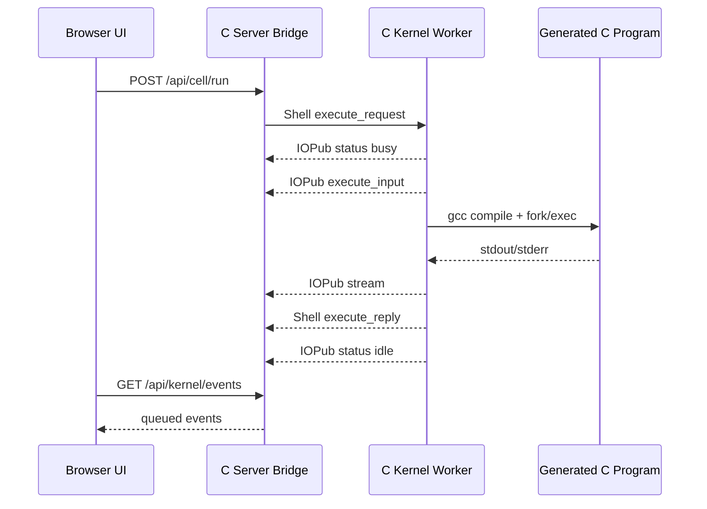

English speaker notes:

We start from the user's perspective. The user writes a C snippet and clicks Run. The browser does not compile C and it does not use ZeroMQ directly. Instead, it sends an HTTP request to the local C server.

The C server is a bridge. On one side, it speaks HTTP to the browser. On the other side, it speaks ZeroMQ to the kernel. When the browser asks to run code, the server sends a Jupyter-style Shell `execute_request` to the C kernel worker.

The kernel compiles and runs the generated C program. While the program is running, output is not only returned at the end. It is streamed through the IOPub channel. The browser polls the server for events and updates the cell output.

Chinese speaker notes:

我們先從使用者角度開始。使用者在 cell 裡寫 C snippet，然後按 Run。瀏覽器本身不會編譯 C，也不會直接使用 ZeroMQ。它只會把 HTTP request 送到本機的 C server。

C server 是一個 bridge。一邊它用 HTTP 跟 browser 溝通；另一邊它用 ZeroMQ 跟 kernel 溝通。當 browser 要求執行 code 時，server 會送出 Jupyter-style Shell `execute_request` 給 C kernel worker。

Kernel 會編譯並執行產生出來的 C program。程式執行時，output 不只是最後才回傳，而是透過 IOPub channel 串流出來。Browser 透過 polling 向 server 拿 event，再更新 cell output。

---

## 2. System Architecture

Slide content:

- Browser UI
- C HTTP Server Bridge
- C Kernel Worker
- Generated C Runtime
- Five ZeroMQ channels

Visual suggestion:

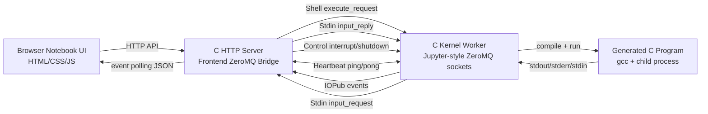

English speaker notes:

The system has four main runtime parts. The browser is the UI. The C HTTP server serves web files and exposes browser APIs. The C kernel worker owns the ZeroMQ kernel sockets. The generated C program is the child process that actually runs the user's code.

This separation is important. The browser remains simple and safe from direct code execution. The server translates browser actions into ZeroMQ messages. The kernel owns compilation, runtime output, stdin requests, interruption, and heartbeat.

Chinese speaker notes:

系統執行時主要有四個部分。Browser 是 UI。C HTTP server 提供網頁檔案，也提供 browser API。C kernel worker 擁有 ZeroMQ kernel sockets。Generated C program 是真正執行使用者 C code 的 child process。

這個分工很重要。Browser 保持簡單，不直接執行 code。Server 把 browser action 轉成 ZeroMQ message。Kernel 負責編譯、runtime output、stdin request、中斷、heartbeat。

---

## 3. Why Five Channels?

Slide content:

```text
Shell      = code request/reply
IOPub      = output and status broadcast
Stdin      = input request/reply
Control    = interrupt and shutdown
Heartbeat  = liveness check
```

Visual suggestion:

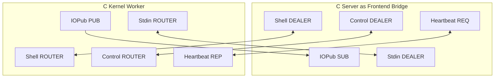

English speaker notes:

Real Jupyter separates responsibilities across multiple sockets. This project follows that idea because it makes the architecture easier to explain.

Shell is for normal code execution requests and replies. IOPub is for output and status events. Stdin is for interactive input. Control is for high-priority commands such as interrupt and shutdown. Heartbeat is for liveness detection.

The benefit is separation of concerns. Output does not block Shell replies. Interrupt does not wait behind a long-running execute request. Heartbeat can still answer a simple ping.

Chinese speaker notes:

真正的 Jupyter 會把不同責任拆到多個 socket。這個專案也跟著這個概念，因為它讓架構更容易解釋。

Shell 負責一般 code execution request/reply。IOPub 負責 output 和 status event。Stdin 負責互動式輸入。Control 負責高優先權命令，例如 interrupt 和 shutdown。Heartbeat 負責檢查 kernel 是否還活著。

好處是責任分離。Output 不會卡住 Shell reply。Interrupt 不需要排在一個長時間 execute request 後面。Heartbeat 可以用很簡單的 ping/pong 檢查存活狀態。

---

## 4. Channel Detail: Shell

Slide content:

- Pattern: frontend `DEALER`, kernel `ROUTER`
- Main messages:
  - `kernel_info_request`
  - `execute_request`
  - `execute_reply`
  - `shutdown_request`

Visual suggestion:

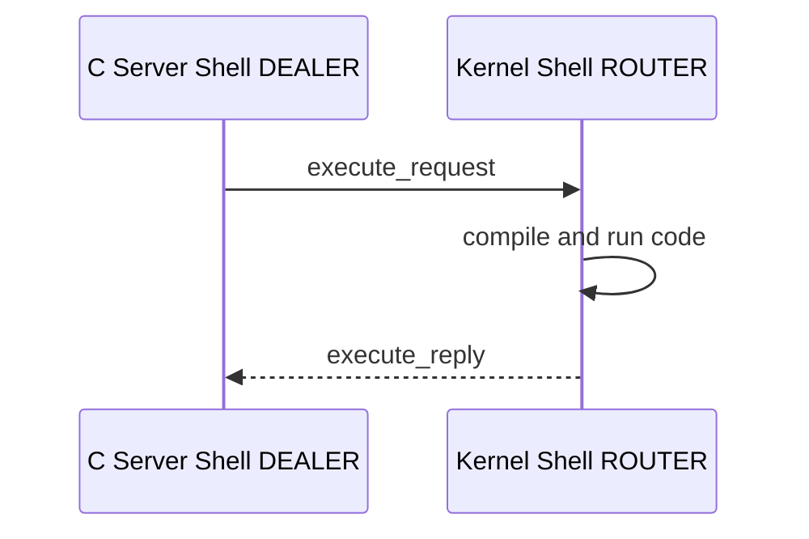

English speaker notes:

The Shell channel is the normal request/reply channel. In this project, the C server creates a frontend-side `DEALER` socket. The kernel creates a `ROUTER` socket bound to port `7010`.

When the browser clicks Run, the server sends an `execute_request` on Shell. The content includes the code, the target cell index, and all notebook cells. The kernel replies with `execute_reply`, including execution status, execution count, run index, and per-cell outputs.

Shell also handles `kernel_info_request`, which lets an external `jupyter_client` ask what language this kernel supports. Our kernel replies with language name `c` and basic implementation metadata.

Chinese speaker notes:

Shell channel 是一般 request/reply channel。在這個專案中，C server 建立 frontend-side `DEALER` socket；kernel 建立 `ROUTER` socket，bind 在 port `7010`。

當 browser 按 Run，server 會透過 Shell 送出 `execute_request`。Content 裡包含 code、目標 cell index、以及所有 notebook cells。Kernel 會回覆 `execute_reply`，裡面包含 execution status、execution count、run index、每個 cell 的 output。

Shell 也處理 `kernel_info_request`，讓外部 `jupyter_client` 可以詢問這個 kernel 支援什麼語言。我們的 kernel 會回覆 language name 是 `c`，以及基本 implementation metadata。

---

## 5. Channel Detail: IOPub

Slide content:

- Pattern: kernel `PUB`, frontend `SUB`
- One-way broadcast
- Main messages:
  - `status`
  - `execute_input`
  - `stream`
  - `error`

Visual suggestion:

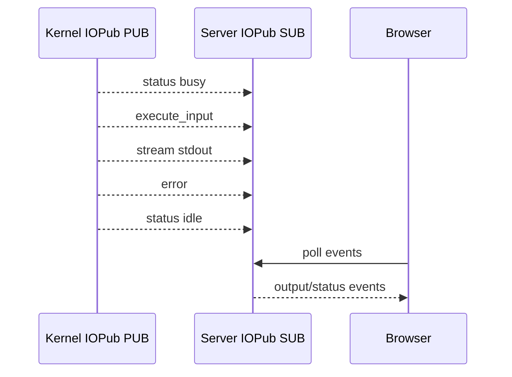

English speaker notes:

IOPub means input/output publish. It is a publish-subscribe channel. The kernel publishes events, and the server subscribes. The browser does not connect to ZeroMQ directly, so it gets IOPub events by polling `/api/kernel/events`.

This channel is how notebook output appears live. When the generated C program prints to stdout, the kernel captures that output from the child process pipe and publishes a `stream` message. The UI receives the event and appends the text to the correct cell.

IOPub also publishes `status` messages such as `busy` and `idle`. This is why the UI can show when the kernel is running or finished. If compilation or runtime fails, the kernel publishes an `error` message.

Chinese speaker notes:

IOPub 代表 input/output publish。它是 publish-subscribe channel。Kernel publish events，server subscribe。Browser 不直接連 ZeroMQ，所以它透過 `/api/kernel/events` polling 拿到 IOPub events。

這個 channel 讓 notebook output 可以即時出現。當 generated C program 印出 stdout，kernel 會從 child process pipe 捕捉 output，然後 publish `stream` message。UI 收到 event 後，把文字加到正確的 cell。

IOPub 也會 publish `status` message，例如 `busy` 和 `idle`。所以 UI 可以知道 kernel 正在執行或已經結束。如果編譯或 runtime 失敗，kernel 會 publish `error` message。

---

## 6. Channel Detail: Stdin

Slide content:

- Pattern: kernel `ROUTER`, frontend `DEALER`
- Main messages:
  - `input_request`
  - `input_reply`
- Demo API:
  - `nb_input("Prompt: ", buffer, size)`

Visual suggestion:

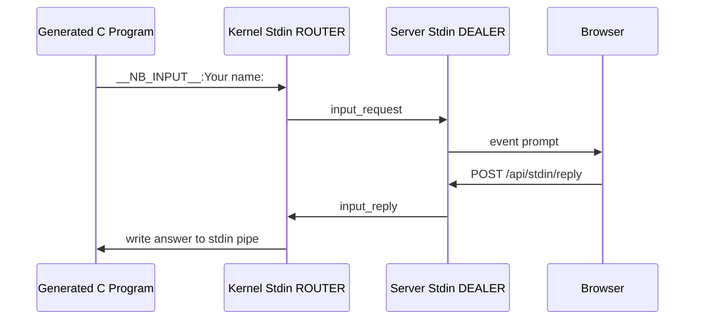

English speaker notes:

Stdin is the channel that explains what happens when running code needs user input. In normal Jupyter, this is used when Python calls `input()`. In our C notebook, we provide a helper function called `nb_input`.

For example, the user writes `nb_input("Your name: ", name, sizeof name);`. The generated C program prints an internal marker. The kernel detects the marker, sends an `input_request` on the Stdin channel, and waits for an `input_reply`.

The browser shows a prompt modal. When the user types a value, the browser sends it to the C server through `/api/stdin/reply`. The server sends an `input_reply` through ZeroMQ. The kernel writes that answer into the child process stdin pipe, and the C program continues.

Chinese speaker notes:

Stdin channel 用來解釋執行中的 code 需要使用者輸入時發生什麼事。在真正的 Jupyter 中，Python 的 `input()` 會使用這個概念。在我們的 C notebook 裡，提供一個 helper function，叫做 `nb_input`。

例如使用者寫 `nb_input("Your name: ", name, sizeof name);`。Generated C program 會印出一個內部 marker。Kernel 偵測到 marker 後，透過 Stdin channel 送出 `input_request`，並等待 `input_reply`。

Browser 會顯示 prompt modal。使用者輸入值後，browser 透過 `/api/stdin/reply` 送給 C server。Server 再透過 ZeroMQ 送出 `input_reply`。Kernel 把答案寫入 child process 的 stdin pipe，C program 就可以繼續執行。

---

## 7. Channel Detail: Control

Slide content:

- Pattern: frontend `DEALER`, kernel `ROUTER`
- High-priority commands
- Main messages:
  - `interrupt_request`
  - `interrupt_reply`
  - `shutdown_request`
  - `shutdown_reply`

Visual suggestion:

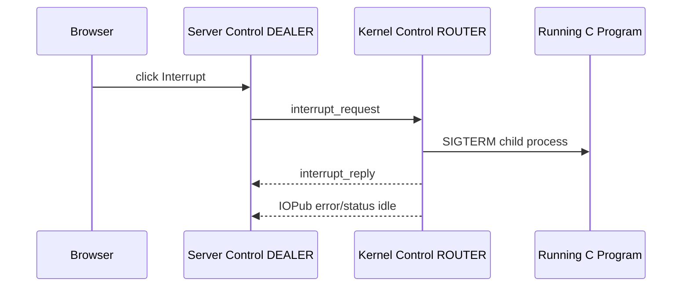

English speaker notes:

Control is separate from Shell because some commands should not wait behind normal execution work. The best example is interrupt. If the user's C code is `while (1) {}`, the Shell execution is busy. We still need another path to tell the kernel to stop it.

When the user clicks Interrupt, the browser calls `/api/kernel/interrupt`. The server sends a Control `interrupt_request`. The kernel receives it while polling multiple sockets, terminates the child process, sends `interrupt_reply`, and publishes error/status events.

Control also supports shutdown. This demonstrates why separating control messages from normal execution messages is useful in real notebook systems.

Chinese speaker notes:

Control 和 Shell 分開，是因為有些命令不應該排在一般 execution work 後面。最好的例子是 interrupt。如果使用者的 C code 是 `while (1) {}`，Shell execution 會正在忙碌。我們仍然需要另一條路告訴 kernel 停止它。

當使用者按 Interrupt，browser 會呼叫 `/api/kernel/interrupt`。Server 送出 Control `interrupt_request`。Kernel 在 polling 多個 sockets 時收到它，終止 child process，送出 `interrupt_reply`，並 publish error/status events。

Control 也支援 shutdown。這展示了為什麼真實 notebook system 要把 control messages 和一般 execution messages 分開。

---

## 8. Channel Detail: Heartbeat

Slide content:

- Pattern: frontend `REQ`, kernel `REP`
- Raw ping/pong
- API:
  - `GET /api/kernel/heartbeat`

Visual suggestion:

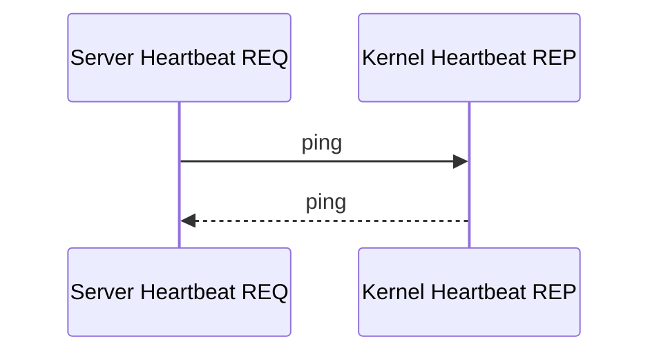

English speaker notes:

Heartbeat is the simplest channel. The frontend sends raw bytes, and the kernel echoes them back. In this project, the browser can call `/api/kernel/heartbeat`, and the server sends a ping on the Heartbeat socket.

If the kernel replies before the timeout, the server reports `alive: true`. If not, it reports `alive: false`. This is useful because a notebook frontend needs to know whether the kernel process is still responding.

This is different from Shell. Heartbeat does not ask the kernel to execute code. It only checks liveness.

Chinese speaker notes:

Heartbeat 是最簡單的 channel。Frontend 送出 raw bytes，kernel 把同樣的 bytes 回傳。在這個專案中，browser 可以呼叫 `/api/kernel/heartbeat`，server 就會透過 Heartbeat socket 送出 ping。

如果 kernel 在 timeout 前回覆，server 回報 `alive: true`。如果沒有，就回報 `alive: false`。這很有用，因為 notebook frontend 需要知道 kernel process 是否還有反應。

這和 Shell 不同。Heartbeat 不要求 kernel 執行 code，只檢查 liveness。

---

## 9. Jupyter Multipart Message Format

Slide content:

```text
idents...
<IDS|MSG>
signature
header
parent_header
metadata
content
```

Visual suggestion:

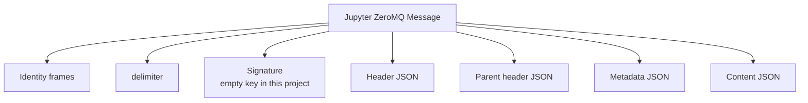

English speaker notes:

Jupyter messages are multipart ZeroMQ messages. This project implements the basic frame shape: identity frames, delimiter, signature, header, parent header, metadata, and content.

The identity frames are important for ROUTER sockets because they tell the kernel how to route replies back to the frontend. The delimiter marks where identities end and the Jupyter message body starts.

For simplicity, this classroom project uses an empty HMAC key, so the signature frame is empty. The message content is JSON. For example, an `execute_request` content includes the code, run index, and cells.

Chinese speaker notes:

Jupyter messages 是 multipart ZeroMQ messages。這個專案實作基本 frame 格式：identity frames、delimiter、signature、header、parent header、metadata、content。

Identity frames 對 ROUTER sockets 很重要，因為它們告訴 kernel reply 要怎麼 route 回 frontend。Delimiter 用來標記 identities 結束，Jupyter message body 開始。

為了課堂 demo 簡化，這個專案使用 empty HMAC key，所以 signature frame 是空的。Message content 使用 JSON。例如 `execute_request` content 會包含 code、run index、cells。

---

## 10. Cumulative C Notebook Execution

Slide content:

- Running cell N compiles cells `0..N`
- One generated C program
- Output markers map output back to cells

Visual suggestion:

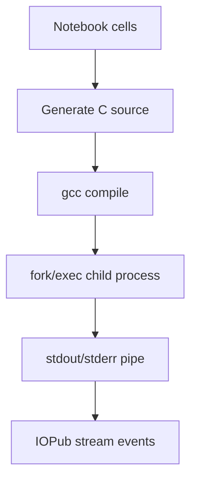

English speaker notes:

C is not an interpreted notebook language by default. To make notebook-style cumulative state possible, the kernel regenerates a complete C program from the top of the notebook to the selected cell.

If cell 0 defines `int x = 42;` and cell 1 prints `x`, running cell 1 compiles both cells into one program. That is why the second cell can use the variable from the first cell.

The generated program includes markers such as `__CELL_START_0__` and `__CELL_END_0__`. The kernel uses those markers to know which output belongs to which cell.

Chinese speaker notes:

C 本來不是 interpreted notebook language。為了做出 notebook-style cumulative state，kernel 會從 notebook 最上面到目前選到的 cell 重新產生一個完整的 C program。

如果 cell 0 定義 `int x = 42;`，cell 1 印出 `x`，執行 cell 1 時會把兩個 cells 一起編譯成同一個 program。所以第二個 cell 可以使用第一個 cell 定義的變數。

Generated program 裡有 marker，例如 `__CELL_START_0__` 和 `__CELL_END_0__`。Kernel 用這些 marker 判斷 output 屬於哪個 cell。

---

## 11. Handling Multiple Sockets with zmq_poll

Slide content:

- Kernel polls Shell, Control, Heartbeat
- Runtime loop watches child output and Control
- Server drains IOPub, Shell, Stdin, Control events

Visual suggestion:

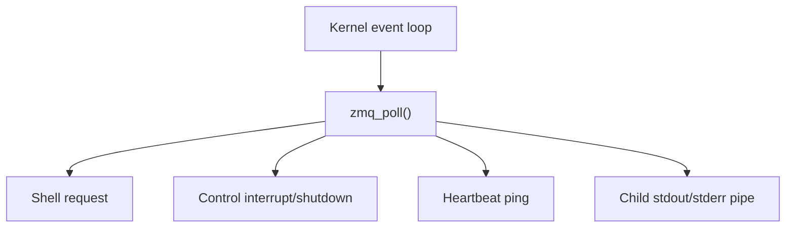

English speaker notes:

This project uses `zmq_poll()` because the kernel must stay responsive to more than one event source. It must receive Shell execution requests, answer Heartbeat pings, and accept Control interrupts.

During code execution, the kernel also watches the child process stdout/stderr pipe. At the same time, it still polls the Control socket, so an infinite loop can be interrupted.

This is a practical example of application problem solving with ZeroMQ. Real services usually cannot block forever on one socket.

Chinese speaker notes:

這個專案使用 `zmq_poll()`，因為 kernel 必須同時回應多種 event source。它要接收 Shell execution request、回答 Heartbeat ping、也要接受 Control interrupt。

在 code 執行期間，kernel 還會監看 child process 的 stdout/stderr pipe。同時，它仍然 poll Control socket，所以 infinite loop 可以被 interrupt。

這是 ZeroMQ application problem solving 的實際例子。真實服務通常不能永遠 block 在一個 socket 上。

---

## 12. Live Demo Flow

Slide content:

```text
Terminal 1: ./build/kernel_worker
Terminal 2: ./build/server
Browser:    http://127.0.0.1:8080
```

Demo cells:

```c
printf("hello zeromq notebook\n");
```

```c
int x = 42;
printf("x is ready\n");
```

```c
printf("x = %d\n", x);
```

```c
char name[64];
nb_input("Your name: ", name, sizeof name);
printf("hello %s\n", name);
```

```c
while (1) {}
```

English speaker notes:

For the live demo, we only need two terminals for the main notebook path. Start `kernel_worker`, then start `server`, then open the browser.

First show normal output through IOPub. Then show cumulative execution with `x`. Then show Stdin with `nb_input`. Finally, run an infinite loop and click Interrupt to show the Control channel.

The old `broker` binary still exists, but it is now an optional ROUTER/DEALER proxy demo, not required for the main notebook execution path.

Chinese speaker notes:

Live demo 的主要 notebook path 只需要兩個 terminal。先啟動 `kernel_worker`，再啟動 `server`，然後打開 browser。

先展示一般 output 透過 IOPub 出現。再展示用 `x` 的 cumulative execution。接著用 `nb_input` 展示 Stdin。最後執行 infinite loop，按 Interrupt，展示 Control channel。

舊的 `broker` binary 還在，但現在它是 optional ROUTER/DEALER proxy demo，不是主要 notebook execution path 必須的元件。

---

## 13. What Each Channel Teaches

Slide content:

- Shell: request/reply
- IOPub: publish/subscribe
- Stdin: reverse request/reply for user input
- Control: high-priority command path
- Heartbeat: liveness check

English speaker notes:

Each channel teaches a different ZeroMQ concept. Shell teaches ROUTER/DEALER request/reply behavior. IOPub teaches PUB/SUB and message envelopes. Stdin teaches that the kernel can ask the frontend for information. Control teaches why high-priority commands should have a separate path. Heartbeat teaches simple liveness detection with REQ/REP.

The point is that ZeroMQ socket types are not just transport choices. They define communication behavior.

Chinese speaker notes:

每個 channel 都教不同的 ZeroMQ 概念。Shell 教 ROUTER/DEALER request/reply 行為。IOPub 教 PUB/SUB 和 message envelopes。Stdin 教 kernel 可以反過來向 frontend 要資料。Control 教為什麼高優先權命令需要獨立路徑。Heartbeat 教簡單的 REQ/REP liveness detection。

重點是 ZeroMQ socket type 不只是傳輸選擇，它們會定義溝通行為。

---

## 14. Extra Chapter Concepts

Slide content:

- ROUTER/DEALER broker demo
- PAIR thread signaling
- Zero-copy messages
- Transport bridge
- High-water marks

Visual suggestion:

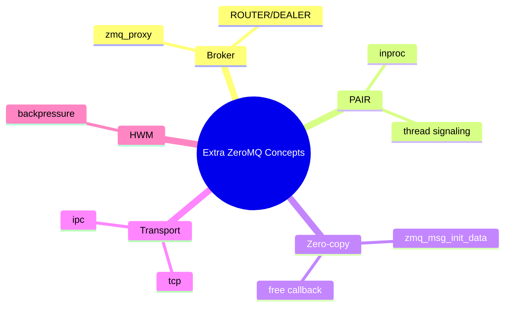

English speaker notes:

Besides the main notebook path, the project still includes extra demo binaries for the Chapter 2 concepts. `broker` demonstrates ROUTER/DEALER proxy and shared queue. `pair_signal_demo` shows PAIR sockets and `inproc://` thread signaling. `zero_copy_demo` shows `zmq_msg_init_data()` and its cleanup callback. `transport_bridge_demo` shows bridging `tcp://` and `ipc://`.

Chinese speaker notes:

除了主要 notebook path，專案仍然保留額外 demo binaries，對應 Chapter 2 的概念。`broker` 展示 ROUTER/DEALER proxy 和 shared queue。`pair_signal_demo` 展示 PAIR sockets 和 `inproc://` thread signaling。`zero_copy_demo` 展示 `zmq_msg_init_data()` 和 cleanup callback。`transport_bridge_demo` 展示 `tcp://` 和 `ipc://` 的 bridging。

---

## 15. Error Handling and Safety

Slide content:

- Compile error
- Runtime error
- Timeout
- Interrupt
- `zmq_errno()` / `zmq_strerror()`

English speaker notes:

Because users type C code, errors are expected. Compile errors are published as error messages and displayed in the notebook. Runtime failures and interrupts also become visible events. Infinite loops can be stopped by Control interrupt or by timeout.

For ZeroMQ failures, the C code uses `zmq_errno()` and `zmq_strerror()` to produce meaningful diagnostics. Long-running processes also handle `SIGINT` and `SIGTERM`.

This is still a trusted local classroom demo. It should not be exposed to a network or used to run untrusted C code.

Chinese speaker notes:

因為使用者會輸入 C code，錯誤是正常情況。Compile error 會被 publish 成 error message，並顯示在 notebook。Runtime failure 和 interrupt 也會變成可見 events。Infinite loop 可以透過 Control interrupt 或 timeout 停止。

ZeroMQ failure 方面，C code 使用 `zmq_errno()` 和 `zmq_strerror()` 產生有意義的診斷訊息。長時間執行的 processes 也處理 `SIGINT` 和 `SIGTERM`。

這仍然是 trusted local classroom demo，不應該暴露到網路，也不應該用來執行不可信任的 C code。

---

## 16. Closing

Slide content:

- Notebook UI is simple
- Backend is message-driven
- ZeroMQ channels separate responsibilities
- Same idea as Jupyter, simplified for teaching

English speaker notes:

To conclude, ZMQBook C starts with a familiar notebook interface, but behind the Run button there is a message-driven architecture. The five channels make the system easier to explain: Shell for execution, IOPub for output, Stdin for input, Control for interruption, and Heartbeat for liveness.

This project does not implement every Jupyter feature. But it demonstrates the core ZeroMQ communication model clearly and gives every socket a role the audience can see.

Chinese speaker notes:

總結來說，ZMQBook C 從大家熟悉的 notebook 介面開始，但 Run button 背後是一個 message-driven architecture。五個 channels 讓系統更容易解釋：Shell 負責 execution、IOPub 負責 output、Stdin 負責 input、Control 負責 interrupt、Heartbeat 負責 liveness。

這個專案沒有實作所有 Jupyter 功能，但它清楚展示 ZeroMQ 的核心通訊模型，而且每個 socket 都有觀眾看得到的角色。

---

## Compact Slide Plan

1. Title: ZMQBook C
2. What happens when we click Run?
3. System architecture
4. Why five channels?
5. Shell channel
6. IOPub channel
7. Stdin channel
8. Control channel
9. Heartbeat channel
10. Jupyter multipart message format
11. Cumulative C execution
12. `zmq_poll()` and responsiveness
13. Live demo
14. Extra ZeroMQ concepts
15. Error handling and closing

---

## Presenter Checklist

Build:

```bash
make clean
make
```

Run:

```bash
./build/kernel_worker
./build/server
```

Open:

```text
http://127.0.0.1:8080
```

Optional channel smoke test:

```bash
python3 tests/smoke_jupyter_channels.py
```

Optional extra demos:

```bash
./build/broker
./build/pair_signal_demo
./build/zero_copy_demo
./build/transport_bridge_demo
```
