# Presentation Slide Content: ZMQBook C

This file is the slide-by-slide version of `presentation/PRESENTATION.md`. It is designed for a 15-20 minute presentation with short slide text, diagrams, and detailed bilingual speaker notes.

## Slide 1 - Title

**On-slide text**

ZMQBook C  
A tiny C notebook powered by ZeroMQ

使用 ZeroMQ 的迷你 C Notebook

**Visual**

Use a screenshot of the browser notebook UI.

**Speaker note**

English: This project is a browser notebook that runs C snippets. The main learning goal is not the UI itself, but how the backend uses Jupyter-style ZeroMQ channels.

中文：這個專案是一個可以執行 C snippet 的 browser notebook。主要學習目標不是 UI 本身，而是後端如何使用 Jupyter-style ZeroMQ channels。

---

## Slide 2 - Click Run Flow

**On-slide text**

Run Cell = Shell request + IOPub output + Shell reply

按下 Run = Shell 請求 + IOPub 輸出 + Shell 回覆

**Visual**

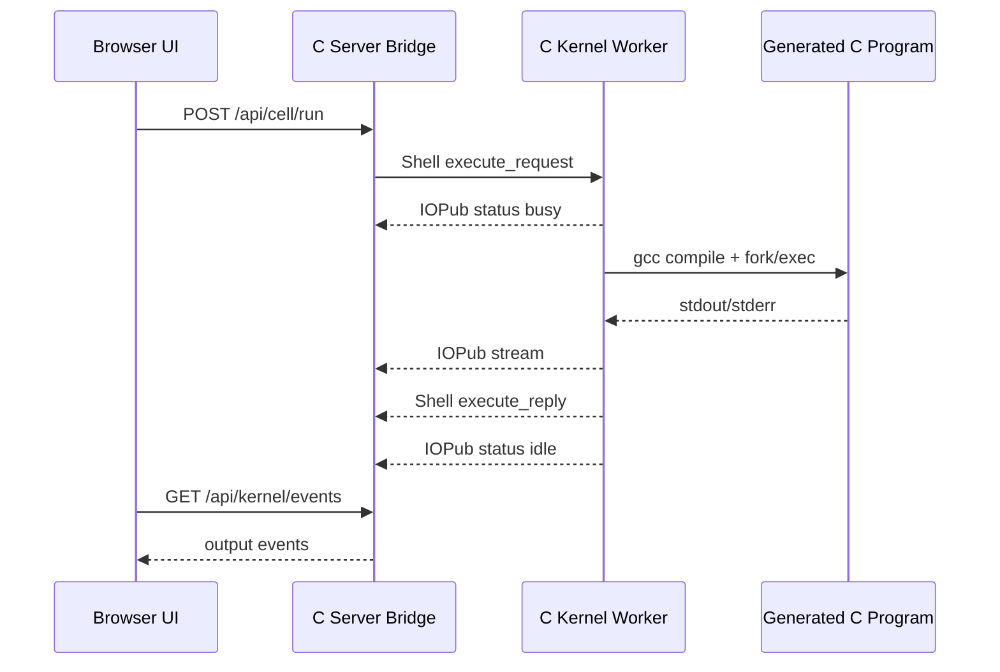

**Project example**

When the user runs:

```c
printf("hello zeromq notebook\n");
```

the browser sends HTTP to the C server. The C server sends ZeroMQ Shell `execute_request`. The kernel streams stdout through IOPub.

**Speaker note**

English: Start here because this is what the audience sees. One browser click becomes multiple messages across different ZeroMQ channels.

中文：從這裡開始，因為這是觀眾最容易理解的使用者動作。Browser 的一次點擊會變成不同 ZeroMQ channels 上的多個 messages。

---

## Slide 3 - System Architecture

**On-slide text**

Browser -> C Server Bridge -> C Kernel -> Generated C Program

Browser -> C Server Bridge -> C Kernel -> 產生的 C 程式

**Visual**

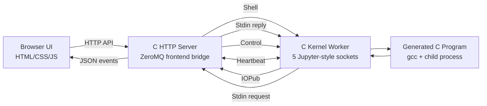

**Project example**

The browser does not talk to ZeroMQ directly. `src/server.c` is the bridge between HTTP and ZeroMQ.

**Speaker note**

English: The system has clear boundaries. Browser is UI, server is bridge, kernel owns sockets and execution, runtime is the child process running user C code.

中文：系統邊界很清楚。Browser 是 UI，server 是 bridge，kernel 擁有 sockets 和 execution，runtime 是真正執行使用者 C code 的 child process。

---

## Slide 4 - The Five Channels

**On-slide text**

- Shell: execute code
- IOPub: publish output
- Stdin: ask user input
- Control: interrupt/shutdown
- Heartbeat: alive check

**Visual**

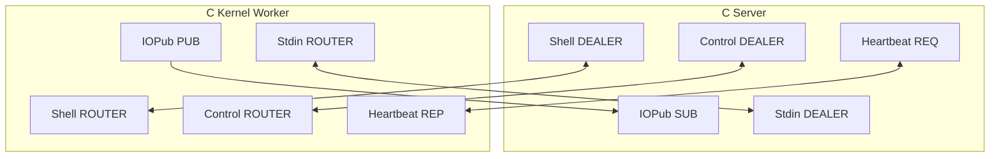

**Project example**

Each channel has a separate purpose, so output, input, interrupts, and liveness checks do not all compete on one socket.

**Speaker note**

English: This is the core slide. Real Jupyter separates responsibilities across sockets. Our project follows that idea in a simplified educational way.

中文：這是核心投影片。真正的 Jupyter 會把不同責任拆到不同 sockets。這個專案用簡化的教學方式跟著這個概念。

---

## Slide 5 - Shell Channel

**On-slide text**

Shell = normal code request/reply

- Frontend: `DEALER`
- Kernel: `ROUTER`
- Port: `7010`

**Visual**

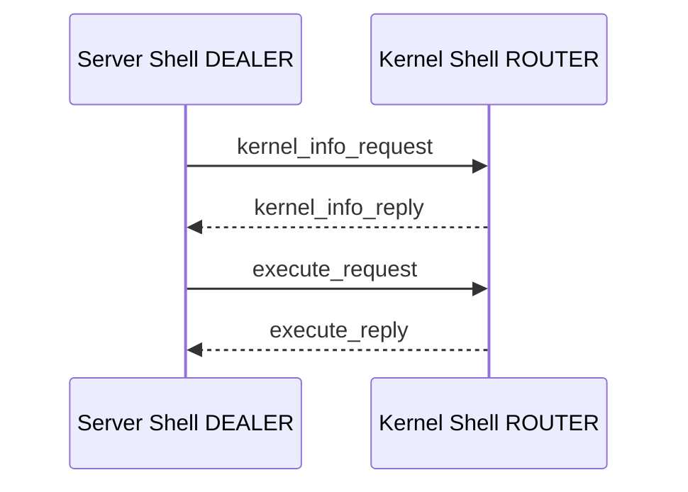

**Project example**

The server sends:

```text
execute_request
content: code, run_index, cells
```

The kernel replies:

```text
execute_reply
content: status, execution_count, outputs
```

**Speaker note**

English: Shell is the main request/reply path. It is where the notebook asks the kernel to execute code and where the final execution status comes back.

中文：Shell 是主要 request/reply 路徑。Notebook 透過它要求 kernel 執行 code，最後 execution status 也從這裡回來。

---

## Slide 6 - IOPub Channel

**On-slide text**

IOPub = output/status broadcast

- Kernel: `PUB`
- Frontend: `SUB`
- Port: `7011`

**Visual**

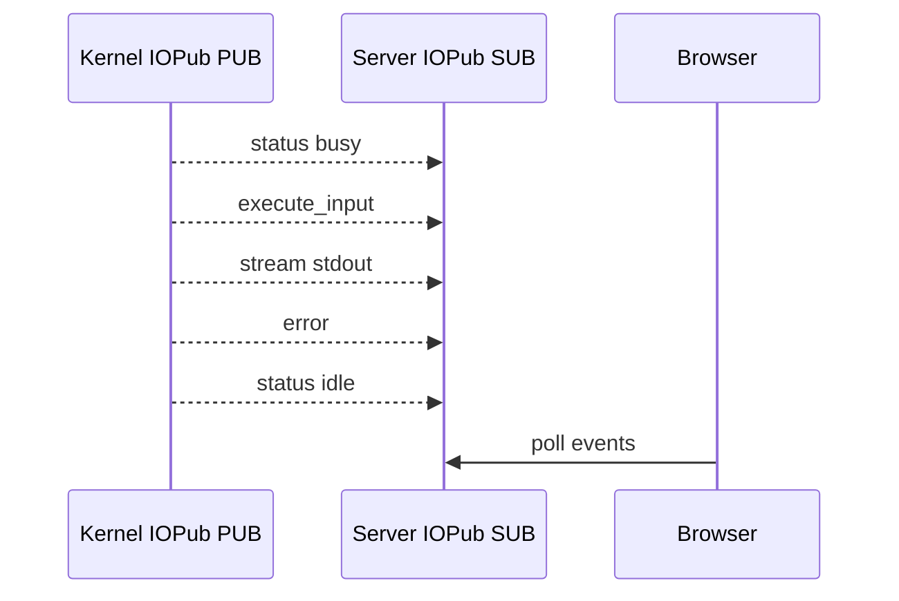

**Project example**

When generated C prints:

```c
printf("hello\n");
```

the kernel publishes:

```text
stream.stdout -> {"text":"hello", "cell_index":0}
```

**Speaker note**

English: IOPub is why output can appear while execution is happening. It is a one-way publish stream from kernel to frontend.

中文：IOPub 讓 output 可以在 execution 進行中就出現。它是 kernel 到 frontend 的單向 publish stream。

---

## Slide 7 - Stdin Channel

**On-slide text**

Stdin = kernel asks browser for input

- Kernel: `ROUTER`
- Frontend: `DEALER`
- Port: `7012`
- Demo: `nb_input()`

**Visual**

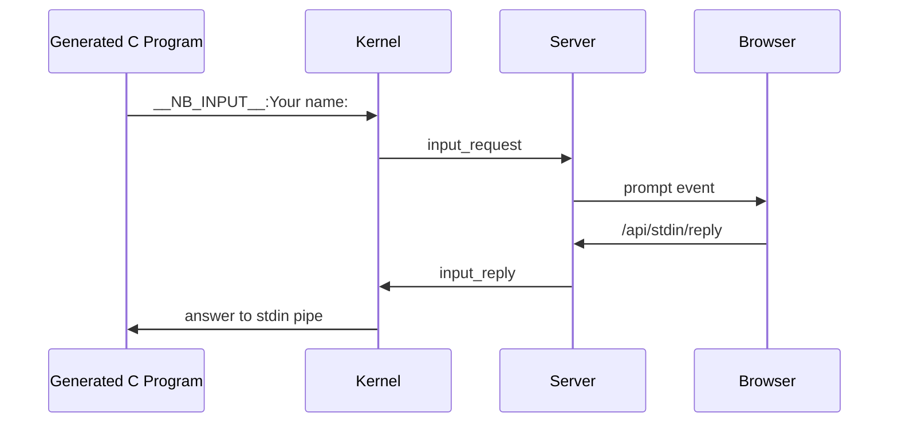

**Project example**

Cell code:

```c
char name[64];
nb_input("Your name: ", name, sizeof name);
printf("hello %s\n", name);
```

The browser shows a prompt modal and sends the answer back through the Stdin channel.

**Speaker note**

English: Stdin is the best channel to explain interactivity. The kernel pauses execution, asks the frontend for data, then resumes the generated C program.

中文：Stdin 是最適合解釋互動性的 channel。Kernel 暫停 execution，向 frontend 要資料，然後讓 generated C program 繼續執行。

---

## Slide 8 - Control Channel

**On-slide text**

Control = high-priority commands

- Frontend: `DEALER`
- Kernel: `ROUTER`
- Port: `7013`
- Interrupt / shutdown

**Visual**

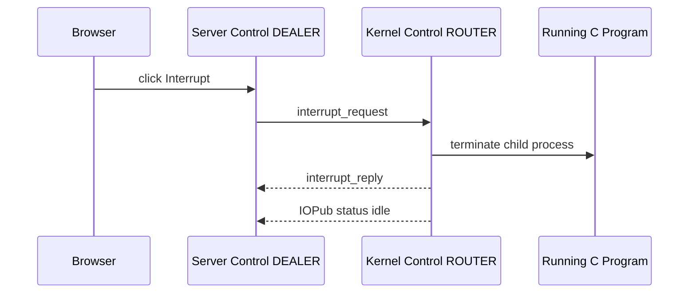

**Project example**

Run:

```c
while (1) {}
```

Then click Interrupt. The Control channel stops the child process without waiting for Shell execution to finish normally.

**Speaker note**

English: Control is separated from Shell so an interrupt can still be delivered while code is running. This is why notebooks can stop long-running cells.

中文：Control 和 Shell 分開，所以 code 正在執行時仍然可以送 interrupt。這就是 notebook 可以停止長時間執行 cell 的原因。

---

## Slide 9 - Heartbeat Channel

**On-slide text**

Heartbeat = is the kernel alive?

- Frontend: `REQ`
- Kernel: `REP`
- Port: `7014`
- Raw ping/pong

**Visual**

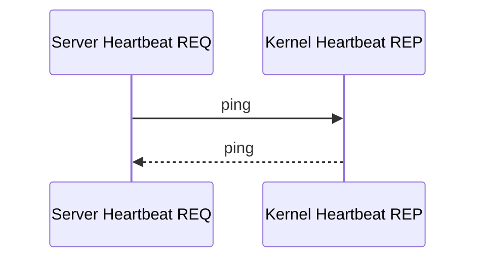

**Project example**

Browser/server API:

```text
GET /api/kernel/heartbeat
```

Response:

```json
{"ok":true,"alive":true}
```

**Speaker note**

English: Heartbeat does not execute code. It only checks whether the kernel process is responding.

中文：Heartbeat 不執行 code。它只檢查 kernel process 是否還有回應。

---

## Slide 10 - Jupyter Multipart Message Format

**On-slide text**

Jupyter ZeroMQ message frames:

```text
idents...
<IDS|MSG>
signature
header
parent_header
metadata
content
```

**Visual**

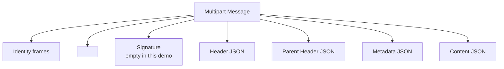

**Project example**

`src/jupyter_proto.c` builds and parses these frames. Empty HMAC key is used for classroom simplicity.

**Speaker note**

English: This is where multipart messages appear now. Instead of only `RUN + JSON`, the project uses Jupyter-style multipart frames.

中文：現在 multipart messages 出現在這裡。專案不只是 `RUN + JSON`，而是使用 Jupyter-style multipart frames。

---

## Slide 11 - Cumulative C Execution

**On-slide text**

Running cell N = compile cells `0..N`

執行第 N 格 = 編譯第 0 到第 N 格

**Visual**

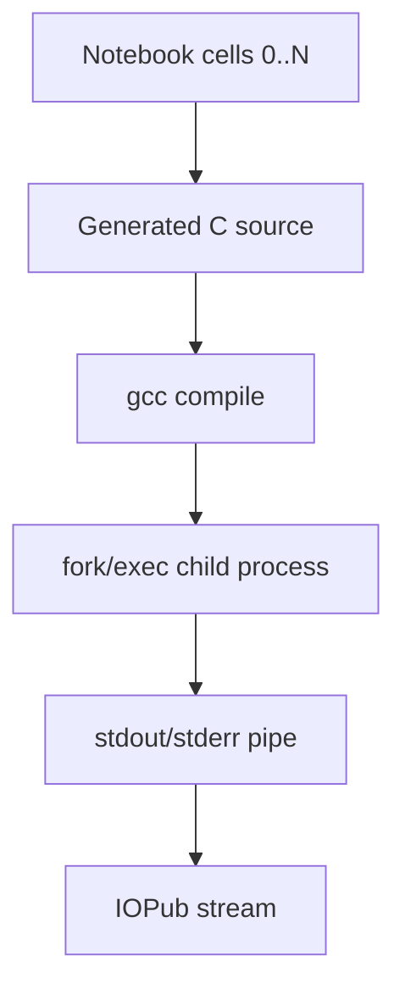

**Project example**

Cell 0:

```c
int x = 42;
```

Cell 1:

```c
printf("x = %d\n", x);
```

Running cell 1 compiles both cells into one generated C program.

**Speaker note**

English: This is how the project creates notebook-like state in C without a real C interpreter.

中文：這是專案在沒有真正 C interpreter 的情況下，做出 notebook-like state 的方法。

---

## Slide 12 - zmq_poll and Responsiveness

**On-slide text**

`zmq_poll()` lets the kernel handle:

- Shell requests
- Control interrupts
- Heartbeat pings
- child process output

**Visual**

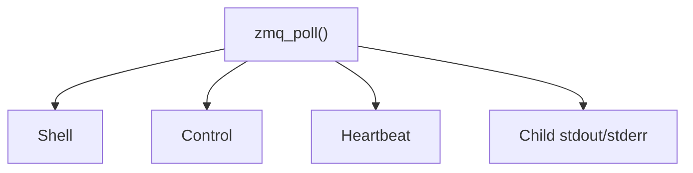

**Project example**

During `while (1) {}`, the kernel still checks the Control socket, so Interrupt can stop the child process.

**Speaker note**

English: Real services cannot block forever on one receive call. Polling is how the kernel remains responsive.

中文：真實服務不能永遠 block 在一個 receive call 上。Polling 讓 kernel 保持 responsive。

---

## Slide 13 - Live Demo

**On-slide text**

Run:

```bash
./build/kernel_worker
./build/server
```

Open:

```text
http://127.0.0.1:8080
```

**Visual**

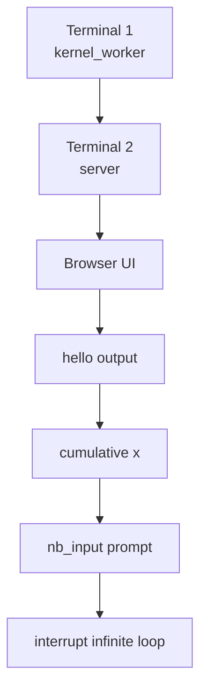

**Project example**

Demo cells:

```c
printf("hello zeromq notebook\n");
```

```c
int x = 42;
printf("x is ready\n");
```

```c
printf("x = %d\n", x);
```

```c
char name[64];
nb_input("Your name: ", name, sizeof name);
printf("hello %s\n", name);
```

```c
while (1) {}
```

**Speaker note**

English: Keep this slide visible during the demo. It shows the exact order and which channel each demo highlights.

中文：Demo 時可以保留這頁。它顯示展示順序，也能說明每個 demo 對應哪個 channel。

---

## Slide 14 - Extra ZeroMQ Concepts

**On-slide text**

Extra demos:

- `broker`: ROUTER/DEALER proxy
- `pair_signal_demo`: PAIR + inproc
- `zero_copy_demo`: `zmq_msg_init_data()`
- `transport_bridge_demo`: TCP to IPC

**Visual**

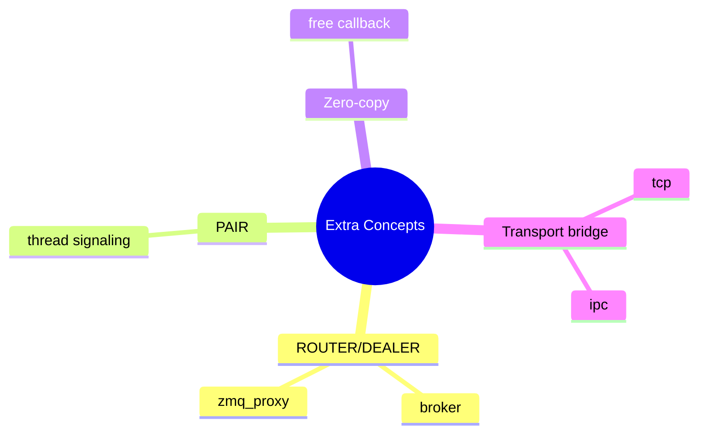

**Project example**

The main notebook no longer needs `broker`, but the binary remains as a presentation demo for shared queue and proxy concepts.

**Speaker note**

English: These extra binaries connect the project back to the other Chapter 2 concepts beyond Jupyter-style channels.

中文：這些額外 binary 可以把專案連回 Chapter 2 中除了 Jupyter-style channels 以外的概念。

---

## Slide 15 - Closing

**On-slide text**

ZeroMQ socket types define behavior.

Jupyter-style channels make notebook communication clear.

**Visual**

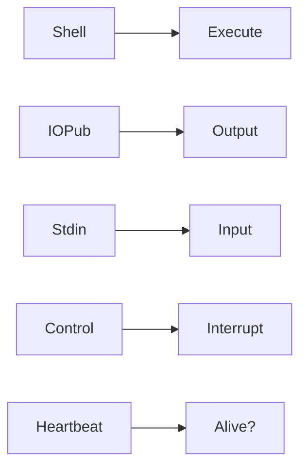

**Project example**

The final notebook is simple on screen, but internally it demonstrates multiple ZeroMQ socket patterns in one project.

**Speaker note**

English: Close by emphasizing that this is not full Jupyter, but it demonstrates the core ZeroMQ communication model clearly.

中文：結尾強調這不是完整 Jupyter，但它清楚展示了 ZeroMQ 核心通訊模型。

---

## Backup Slide - Channel Summary Table

| Channel | Frontend socket | Kernel socket | What it does |
| --- | --- | --- | --- |
| Shell | `DEALER` | `ROUTER` | Code execution request/reply |
| IOPub | `SUB` | `PUB` | Output, status, errors |
| Stdin | `DEALER` | `ROUTER` | Browser input for running code |
| Control | `DEALER` | `ROUTER` | Interrupt and shutdown |
| Heartbeat | `REQ` | `REP` | Liveness ping/pong |

## Backup Slide - Important Files

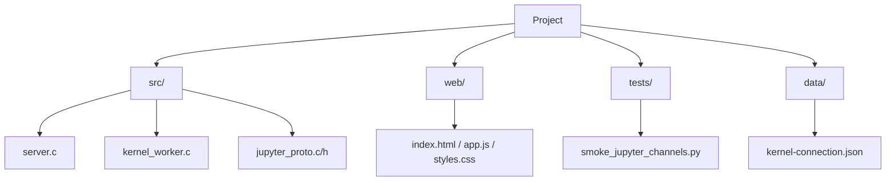
