# Presentation Slide Content

This file is the slide-by-slide version of `PRESENTATION.md`. It is designed for a 15-20 minute presentation where the slides contain pictures, Mermaid diagrams, short keywords, and project-specific examples.

Use this format:

- Put **On-slide text** directly on the slide.
- Use **Visual** as the main diagram, screenshot, or animation.
- Use **Project example** to explain how the concept appears in this mini C notebook clone.
- Use **Speaker note** as your bilingual talking guide.

## Slide 1 - Title

**On-slide text**

ZMQBook C  
A tiny C notebook powered by ZeroMQ

ZMQBook C  
使用 ZeroMQ 的迷你 C Notebook

**Visual**

Use a screenshot of the notebook UI after it runs in the browser.

```text
http://127.0.0.1:8080
```

**Project example**

This project looks like a small notebook in the browser, but internally it is a ZeroMQ system:

- Browser UI: writes C cells.
- C HTTP server: receives browser API requests.
- ZeroMQ broker: routes execution jobs.
- C kernel worker: compiles and runs the generated C program.

**Speaker note**

English: Introduce the project as a notebook-like web app for running C snippets. The important part is not only the UI, but the backend architecture: C components communicate through ZeroMQ.

中文：介紹這是一個 notebook 風格的網頁應用，可以執行 C 程式片段。重點不只是 UI，而是後端架構：多個 C 元件透過 ZeroMQ 溝通。

## Slide 2 - Why Build This?

**On-slide text**

Goal: make ZeroMQ visible through a real project

目標：用真實專案呈現 ZeroMQ 概念

**Visual**

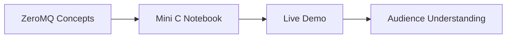

**Project example**

Instead of only showing isolated socket examples, the project combines multiple ZeroMQ ideas in one workflow: run a C cell, send a job through a broker, execute it in a worker, and return output to the browser.

**Speaker note**

English: Explain that the project is a teaching tool. It does not try to replace Jupyter. It uses a notebook-like interface because the audience can easily understand the action: write code, click run, see output.

中文：說明這個專案是教學工具，不是要取代 Jupyter。使用 notebook 形式是因為觀眾很容易理解：寫程式、按 Run、看到輸出。

## Slide 3 - User View: Notebook UI

**On-slide text**

- Add / delete cells
- Run one cell
- Run all cells
- Save notebook
- Show output per cell

- 新增 / 刪除 cell
- 執行單一 cell
- 執行全部 cells
- 儲存 notebook
- 每個 cell 顯示自己的輸出

**Visual**

Use a screenshot of the browser UI. Highlight:

- Code editor
- Run button
- Output panel
- Execution counter

**Project example**

The browser only handles user interaction. It does not compile C and it does not use ZeroMQ directly. It sends HTTP API requests to the C server.

**Speaker note**

English: Start with what the user sees. This makes the backend easier to explain later because the audience knows what action triggers the system.

中文：先從使用者看到的畫面開始。這樣後面介紹後端時，觀眾會知道是哪個使用者動作觸發整個系統。

## Slide 4 - What Happens When We Click Run?

**On-slide text**

Run Cell = HTTP request + ZeroMQ request + compile/run + response

按下 Run Cell = HTTP 請求 + ZeroMQ 請求 + 編譯執行 + 回傳結果

**Visual**

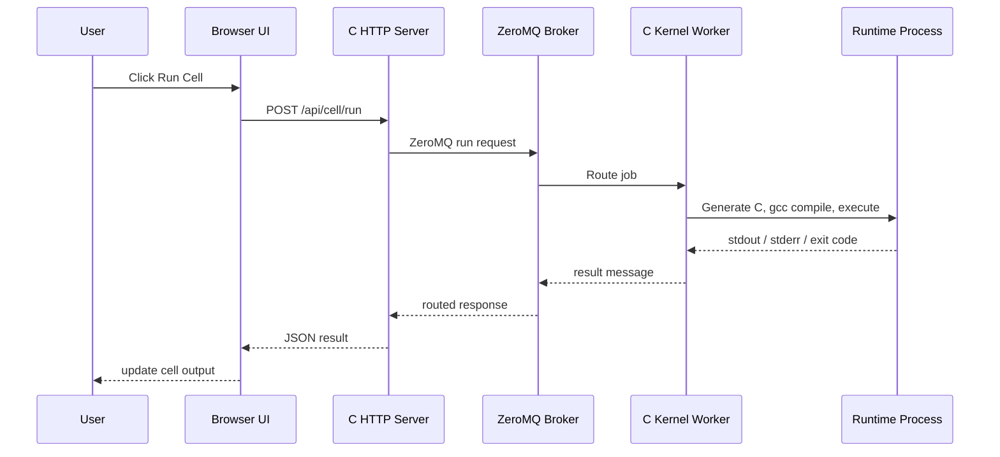

**Project example**

If cell 0 contains:

```c
int x = 42;
```

and cell 1 contains:

```c
printf("x = %d\n", x);
```

running cell 1 sends both cells to the worker, because the notebook state is cumulative.

**Speaker note**

English: This is the main flow. Emphasize that one click in the browser becomes a distributed message path across multiple C programs.

中文：這是最重要的流程。強調瀏覽器的一次點擊，會變成多個 C 程式之間的分散式訊息傳遞。

## Slide 5 - Simple System Architecture

**On-slide text**

Browser -> C Server -> ZeroMQ Broker -> C Worker -> Runtime -> Browser

瀏覽器 -> C Server -> ZeroMQ Broker -> C Worker -> 執行程式 -> 瀏覽器

**Visual**

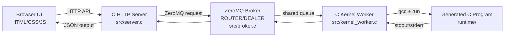

**Project example**

This architecture separates responsibilities:

- The browser is only UI.
- The server is the HTTP bridge.
- The broker is the ZeroMQ intermediary.
- The worker is the execution engine.
- The generated runtime process is where user C code actually runs.

**Speaker note**

English: Use this as the main architecture slide. The broker is important because it decouples the web server from the execution workers.

中文：這頁是主要架構圖。broker 很重要，因為它把 web server 和 execution worker 解耦。

## Slide 6 - Socket API Lifecycle

**On-slide text**

1. Create / destroy
2. Configure
3. Bind / connect
4. Send / receive

1. 建立 / 關閉
2. 設定 socket
3. 接上 topology
4. 傳送 / 接收資料

**Visual**

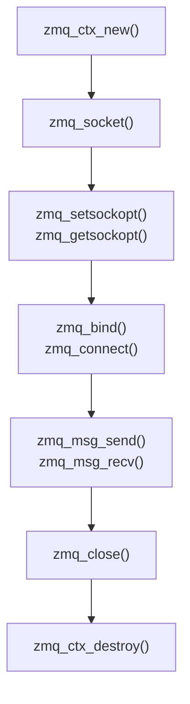

**Project example**

In the mini notebook:

- `src/server.c` creates a ZeroMQ socket to send execution requests.
- `src/broker.c` creates ROUTER and DEALER sockets.
- `src/kernel_worker.c` creates a worker socket to receive jobs.
- Shutdown code closes sockets and destroys contexts.

**Speaker note**

English: Connect this to Jimmy's Socket API part. The project uses the real ZeroMQ C API, so the lifecycle is visible in real code.

中文：把這頁連到 Jimmy 的 Socket API。這個專案使用真正的 ZeroMQ C API，所以 socket lifecycle 可以在程式碼中看到。

## Slide 7 - Bind and Connect Topology

**On-slide text**

`bind()` creates a stable endpoint  
`connect()` joins that endpoint

`bind()` 建立穩定 endpoint  
`connect()` 連到 endpoint

**Visual**

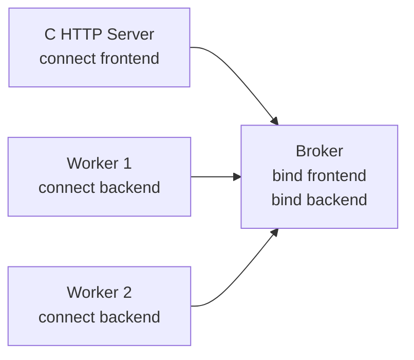

**Project example**

In this project, the broker is the meeting point:

- Broker binds the frontend endpoint used by the server.
- Broker binds the backend endpoint used by workers.
- Server connects to broker frontend.
- Workers connect to broker backend.

This means more workers can be started without changing the browser or server.

**Speaker note**

English: Explain that ZeroMQ topology is not the same as HTTP. `bind()` and `connect()` describe how nodes join the message topology.

中文：說明 ZeroMQ topology 不等於 HTTP。`bind()` 和 `connect()` 是描述節點如何加入訊息拓樸。

## Slide 8 - Request/Reply Behavior

**On-slide text**

Request: run selected notebook cells  
Reply: return compile/runtime result

請求：執行選定 notebook cells  
回覆：回傳編譯與執行結果

**Visual**

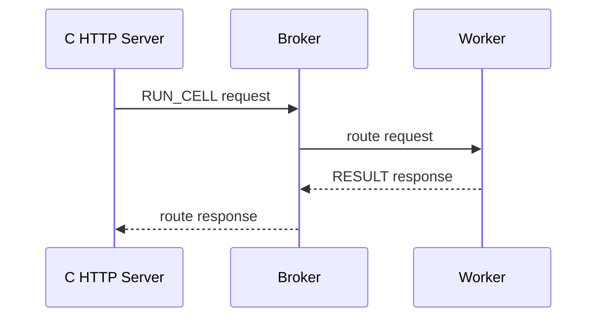

**Project example**

For the browser, the action is simple: "run this cell."  
For the backend, it becomes a request/reply job:

- Request data: command, cell index, notebook source.
- Reply data: status, stdout, stderr, exit code, timeout flag.

**Speaker note**

English: The project behaves like request/reply even though the broker internally uses ROUTER/DEALER. The server sends work and expects exactly one result.

中文：雖然 broker 內部使用 ROUTER/DEALER，但整體行為像 request/reply。server 送出工作，並期待一個結果。

## Slide 9 - ROUTER/DEALER Shared Queue

**On-slide text**

Broker = intermediary + shared queue

Broker = 中介者 + shared queue

**Visual**

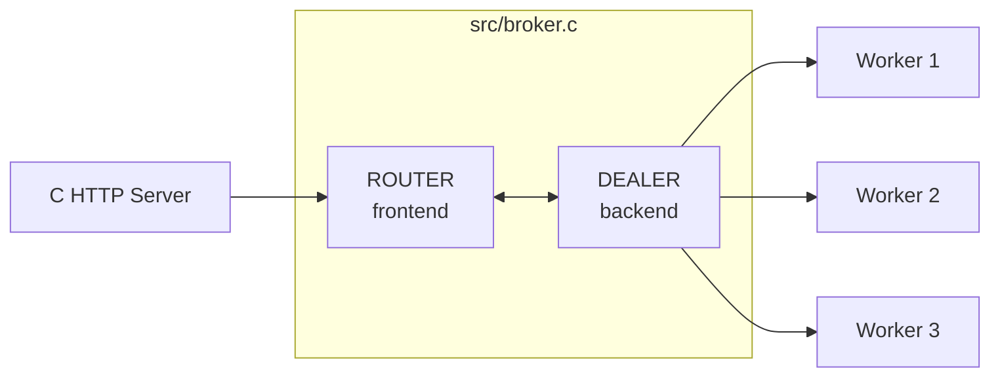

**Project example**

If three students click Run at around the same time:

- The server sends jobs to the broker.
- The broker does not compile anything.
- The broker forwards jobs to available workers.
- Workers can be added dynamically.

This demonstrates Andrew's intermediary, shared queue, dynamic discovery, and `zmq_proxy()` topics.

**Speaker note**

English: The broker lets us scale the execution side. The web server does not need to track worker addresses or worker count.

中文：broker 讓 execution 端可以擴充。web server 不需要知道 worker 的 address，也不需要知道目前有幾個 worker。

## Slide 10 - Multipart Messages in This Notebook

**On-slide text**

Notebook request = multiple frames

command + cell index + cell source

Notebook request = 多個 frames  
command + cell index + cell source

**Visual**

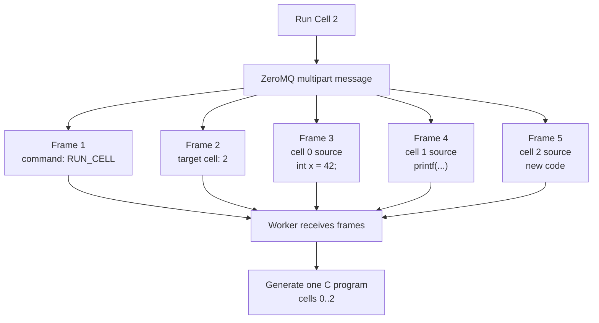

**Project example**

Example notebook:

```c
// Cell 0
int x = 42;

// Cell 1
printf("x = %d\n", x);

// Cell 2
printf("done\n");
```

When running cell 2, the worker needs the selected cell index and all source code up to that cell. Multipart frames make this clear:

- Frame 1 says what operation to perform.
- Frame 2 says which cell is being run.
- Later frames carry the C source snippets.
- The receiver uses `zmq_msg_recv()` and checks `ZMQ_RCVMORE` to know whether more frames are coming.

**Speaker note**

English: This is the concrete answer to "where do multipart messages appear?" They appear in the run-cell job. Instead of sending one huge string, the request can be separated into command, metadata, and code frames. That matches ZeroMQ's message model and makes routing/parsing cleaner.

中文：這頁回答「multipart messages 在專案中哪裡出現？」它出現在 run-cell job。request 不需要是一個很大的字串，而是可以分成 command、metadata、code frames。這符合 ZeroMQ 的訊息模型，也讓 routing 和 parsing 更清楚。

## Slide 11 - Kernel Worker Pipeline

**On-slide text**

Cells become one generated C program  
Running cell N compiles cells 0..N

Cells 會變成一個產生出來的 C 程式  
執行第 N 格 = 編譯 0 到 N 格

**Visual**

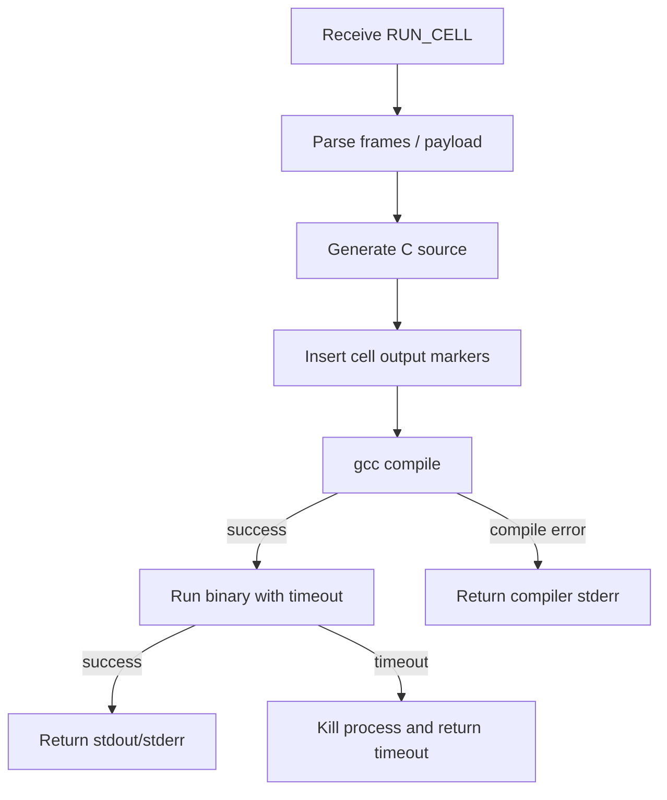

**Project example**

Generated program idea:

```c
#include <stdio.h>
#include <stdlib.h>
#include <string.h>

int main(void) {
    printf("__CELL_START__:0\n");
    int x = 42;
    printf("__CELL_END__:0\n");

    printf("__CELL_START__:1\n");
    printf("x = %d\n", x);
    printf("__CELL_END__:1\n");
    return 0;
}
```

The markers help the UI map runtime output back to notebook cells.

**Speaker note**

English: This explains how a C notebook can have cumulative state without keeping a long-running C interpreter. The worker rebuilds a program from the top.

中文：這裡說明 C notebook 如何做到累積狀態，而不需要真正的長時間 C interpreter。worker 會從最上面的 cell 重新組出一個程式。

## Slide 12 - Handling Multiple Sockets and Timeouts

**On-slide text**

`zmq_poll()` keeps services responsive

`zmq_poll()` 讓服務不會永遠卡住

**Visual**

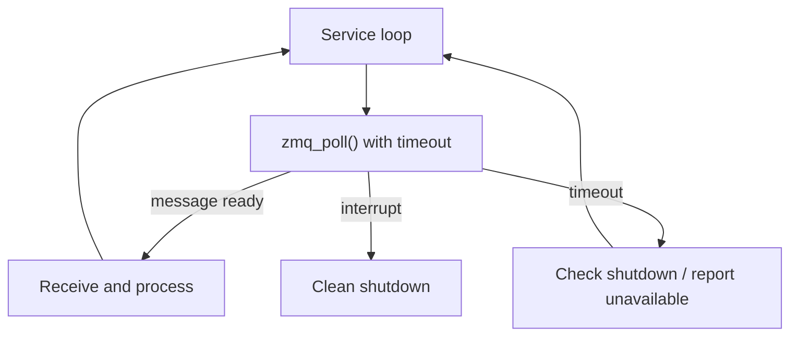

**Project example**

In this mini notebook, blocking forever is bad:

- If no worker is running, the server should report execution unavailable.
- If user code runs forever, the worker should timeout and kill the child process.
- If Ctrl-C is pressed, services should close sockets and exit.

**Speaker note**

English: Connect this to handling multiple sockets and application problem solving. Real systems need timeouts and shutdown paths, not only send and receive.

中文：把這頁連到 handling multiple sockets 和 application problem solving。真實系統不只需要 send/receive，也需要 timeout 和 shutdown path。

## Slide 13 - PUB/SUB Status Events

**On-slide text**

Status topic = message envelope

Status topic = message envelope

**Visual**

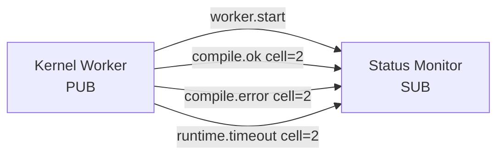

**Project example**

Example status messages:

```text
worker.start worker-1
compile.ok cell=2
compile.error cell=2
runtime.timeout cell=2
```

The first word is the topic. A subscriber can choose only the messages it wants, such as `compile` events.

**Speaker note**

English: Use this to explain Pub/Sub envelopes. The envelope is not a separate visual envelope; it is the topic prefix that lets subscribers filter messages.

中文：用這頁解釋 Pub/Sub envelopes。envelope 不一定是視覺上的信封，而是 topic prefix，讓 subscriber 可以過濾訊息。

## Slide 14 - PAIR, Zero-Copy, Transport Bridge, HWM

**On-slide text**

Extra concepts connected to the project

額外概念也能連回專案

**Visual**

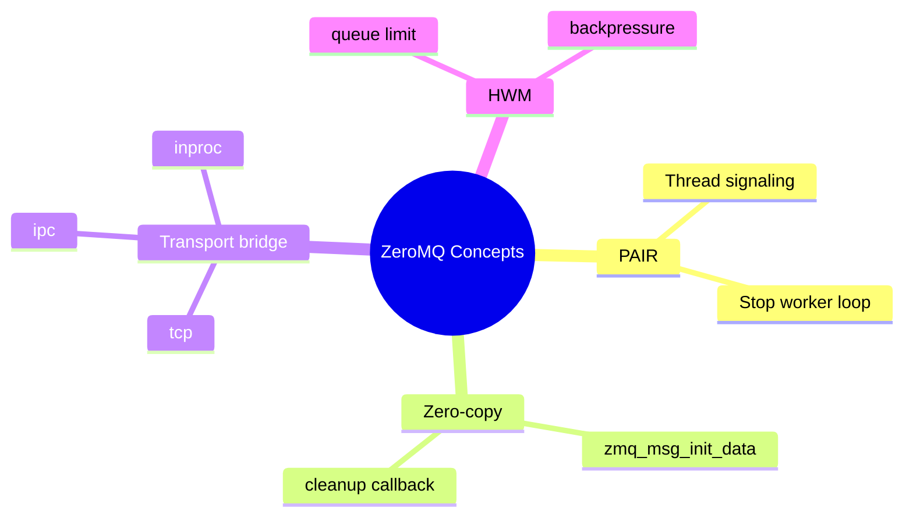

**Project example**

- PAIR: signal between threads, for example "shutdown now".
- Zero-copy: send a pre-existing buffer with `zmq_msg_init_data()`; the fourth argument is the free callback for cleanup.
- Transport bridge: connect one side with `tcp://` and another with `ipc://`.
- HWM: if compile jobs arrive faster than workers can run them, high-water mark limits queue growth.

**Speaker note**

English: These are supporting demos. They show that ZeroMQ is useful beyond the main request path.

中文：這些是輔助 demo。它們說明 ZeroMQ 不只用在主要 request path，也可以處理 thread signaling、transport bridging 和 backpressure。

## Slide 15 - Error Handling and Interrupts

**On-slide text**

Good demo behavior:

- compile errors
- runtime timeout
- ZeroMQ errors
- Ctrl-C shutdown

好的 demo 行為：

- 編譯錯誤
- runtime timeout
- ZeroMQ 錯誤
- Ctrl-C 關閉

**Visual**

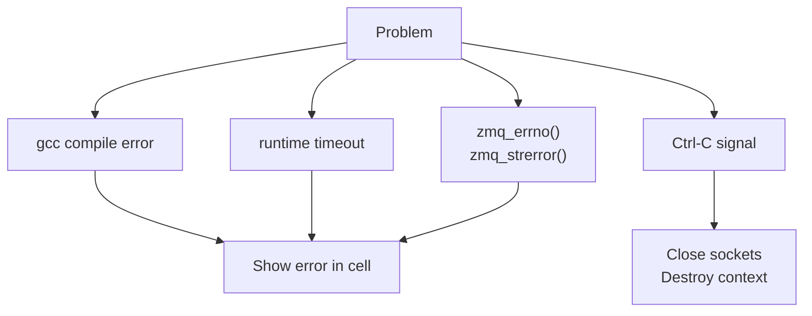

**Project example**

Compile error demo:

```c
printf("missing semicolon")
```

Runtime timeout demo:

```c
while (1) {}
```

The project should show a clear error instead of silently failing or hanging.

**Speaker note**

English: Explain that error handling is part of the architecture. This makes the live demo understandable and prevents one bad cell from stopping the whole presentation.

中文：說明 error handling 是架構的一部分。這讓 live demo 更容易理解，也避免一個錯誤 cell 讓整個展示卡住。

## Slide 16 - Live Demo Script

**On-slide text**

1. Start broker
2. Start worker
3. Start server
4. Open browser
5. Run C cells

1. 啟動 broker
2. 啟動 worker
3. 啟動 server
4. 開啟 browser
5. 執行 C cells

**Visual**

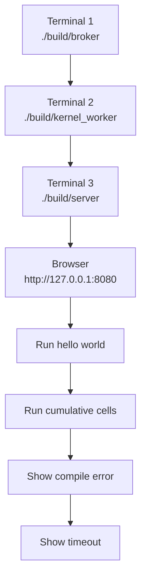

**Project example**

Recommended live cells:

```c
printf("hello zeromq notebook\n");
```

```c
int x = 42;
```

```c
printf("x = %d\n", x);
```

**Speaker note**

English: Keep this slide visible during the demo so the audience understands which terminal belongs to which system component.

中文：demo 時可以保留這頁，讓觀眾知道每個 terminal 對應哪個系統元件。

## Slide 17 - Architecture Animation

**On-slide text**

Request path and response path

請求路徑與回覆路徑

**Visual**

Use the Manim architecture animation.

```bash
animation/.venv/bin/python -m manim -qm --media_dir animation/media animation/architecture_animation.py ZeroMQNotebookArchitecture
```

Expected local video:

```text
animation/media/videos/architecture_animation/720p30/ZeroMQNotebookArchitecture.mp4
```

**Project example**

The animation should show:

1. Browser sends run request.
2. Server passes it into ZeroMQ.
3. Broker routes it to worker.
4. Worker compiles and runs C.
5. Result flows back to browser.

**Speaker note**

English: Use the animation to make the invisible message flow visible. It helps the audience see direction and responsibility.

中文：用動畫把看不見的 message flow 視覺化。它可以幫助觀眾看懂方向和每個元件的責任。

## Slide 18 - Mapping to Presentation Concepts

**On-slide text**

Project feature -> ZeroMQ concept

專案功能 -> ZeroMQ 概念

**Visual**

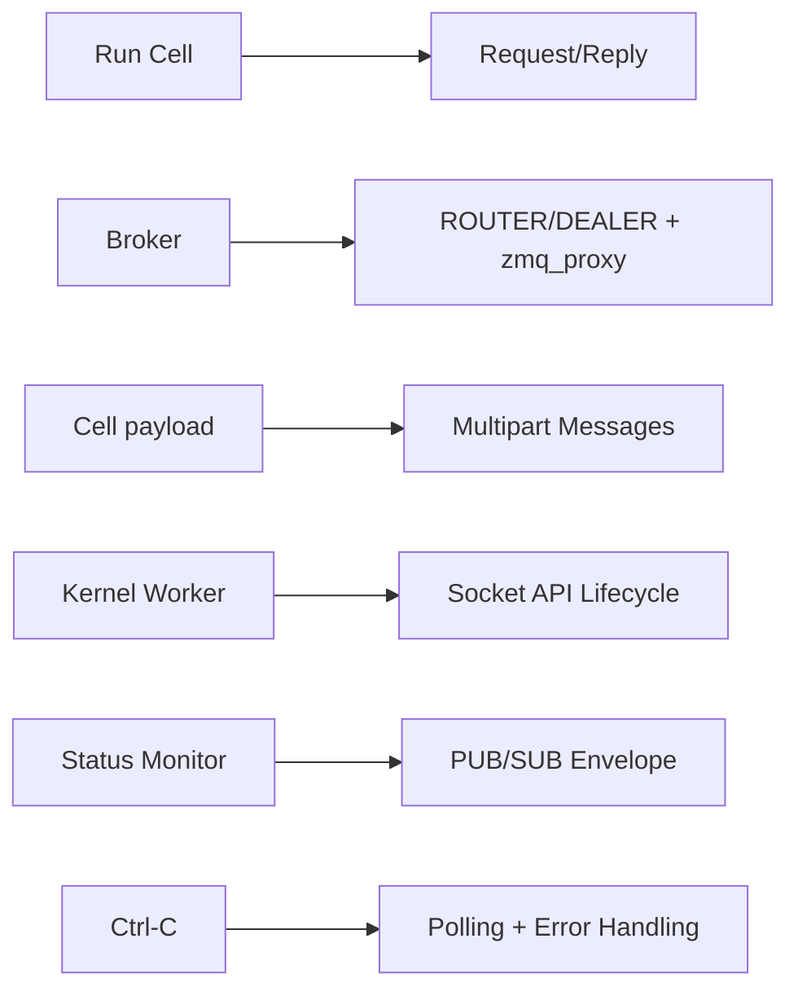

**Project example**

This slide is the summary:

- Socket API: all backend components create/configure/connect/send/receive/close sockets.
- Topology: broker binds; server and workers connect.
- Messaging patterns: request/reply, ROUTER/DEALER, PUB/SUB, PAIR.
- Problem solving: proxy, shared queue, polling, timeout, error reporting.

**Speaker note**

English: This is the bridge back to your original Chapter 2 material. Every major concept has a place in the project.

中文：這頁把專案連回原本 Chapter 2 的簡報內容。每個主要概念都能在專案中找到位置。

## Slide 19 - Closing

**On-slide text**

ZeroMQ is not just sockets.  
It is a messaging architecture toolkit.

ZeroMQ 不只是 sockets。  
它是一個 messaging architecture toolkit。

**Visual**

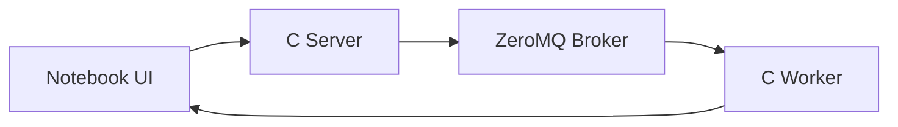

**Project example**

The final product is a mini notebook, but the real lesson is how ZeroMQ helps separate components, route messages, support workers, and return results.

**Speaker note**

English: Close by saying the notebook is the demo, but ZeroMQ architecture is the learning target.

中文：結尾說 notebook 是 demo 成果，但真正的學習目標是 ZeroMQ architecture。

## Optional Backup Slide - Files in the Project

**On-slide text**

Important files:

- `src/server.c`
- `src/broker.c`
- `src/kernel_worker.c`
- `web/app.js`
- `animation/architecture_animation.py`

**Visual**

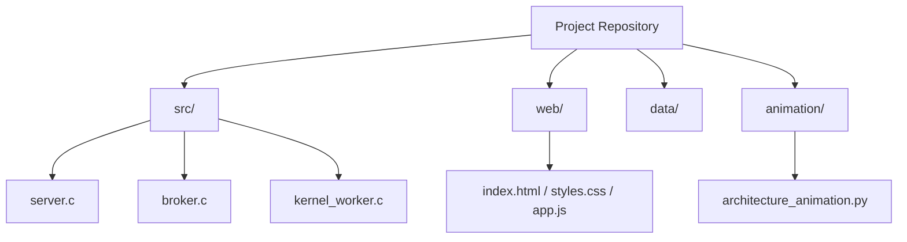

**Project example**

Use this slide if someone asks where the implementation lives.

**Speaker note**

English: This is a backup slide for code walkthrough questions.

中文：這是備用投影片，可以用來回答程式碼檔案分布的問題。
